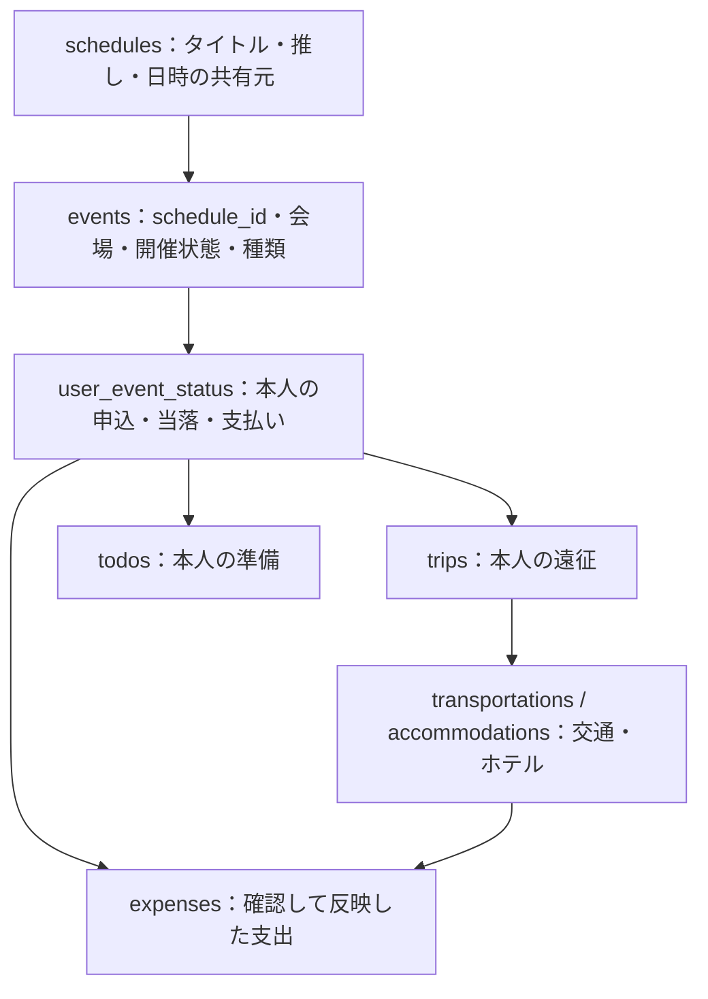

# Oshilife v2 — Phase 6 / イベント管理 Step 3-1

## イベント管理 Step 3-1：同行者（自分だけ）

イベント詳細の「同行者を管理する」から、同行者の名前・メモを追加・編集できます。
利用終了にすると通常一覧から隠れ、記録を残したまま再開できます。同名登録可能で、自分はイベントごとに1人です。
本人の「自分の管理」を保存したイベントで利用でき、他ユーザーには共有されません。

011_event_participants.sqlは適用済みです。既存21テーブルを変更せず、event_participantsだけを追加しました。
共同支出・立替・精算・お金管理との連携は今回の対象外です。
バックアップ・復元・migration・復旧方法・テスト結果は[Step 3-1実装報告](docs/EVENT_STEP3_1.md)を参照してください。

### 主要ファイルの役割（Step 3-1）

| ファイル / ディレクトリ | 役割 |
|---|---|
| public/event_companions.php | 同行者一覧と追加・編集・利用終了・再開の画面 |
| public/event_detail.php | 同行者画面への本人専用の入口 |
| public/api/events/companions/・api/events/companions/ | 同行者APIの公開入口と操作ごとの入口 |
| app/helpers/participant_api.php | ログイン・CSRF・入力ID・JSON応答 |
| app/services/participant_service.php | 自分の一意性、入力検証、保存・利用終了 |
| app/repositories/participant_repository.php | 所有ユーザーとイベントを限定したDB取得 |
| database/migrations/011_event_participants.sql | 新テーブル・INDEX・制約の追加 |

### 処理の流れ（Step 3-1）

```text
同行者画面で保存
↓ 既存events.jsが入力をJSONにして送信
同行者API → ログイン・CSRF確認
↓
本人のイベント管理を確認 → 自分の重複・参加者の所有者を確認
↓
event_participantsだけに保存 → JSON応答 → 画面を再表示
```

画面表示だけではDBに書き込みません。自分の行は初回の保存時に作成します。
APIは画面から処理を依頼する入口です。所有者はセッション（サーバーのログイン記録）から判断し、SQLへの値はプリペアドステートメントで安全に渡します。
以下のStep 2以前の章は既存機能と導入履歴です。現在の参加判定はStep 2の「参加確定」が基準です。


## イベント管理 Step 2：参加確定から準備を始める

抽選LIVE・先着イベント・予約制舞台・無料展覧会を同じイベント管理で扱えるようになりました。登録／編集で6種類を選択し、「自分の管理」で受付方式と参加状況を保存してください。

| 項目 | 意味 | 例 |
|---|---|---|
| 受付方式 | 参加手続きの種類 | 抽選・先着・予約・申込不要・未確認 |
| 申込状況 | 手続きをどこまで進めたか | 未申込・手続き中・申込済み・申込不要 |
| 抽選結果 | 抽選で選ばれたか | 結果待ち・当選・落選。非抽選は対象外 |
| 参加状況 | 実際に参加するか | 検討中・参加確定・不参加・取消 |
| 販売区分 | どの受付枠か | FC・一般販売・制作開放・公式先行 |
| 支払い状況 | お金を支払ったか | 未完了・支払い済み。0円は支払い不要表示 |

例えば「予約済みの舞台」は当選という結果を持ちません。「一般販売」は購入済みを意味しません。そのため各状態を分け、TODO生成を**当選から参加確定**へ変更しました。新画面では本人が参加状況を選びます。

- 抽選LIVE：抽選 → 申込済み → 当選 → 参加確定 → 準備TODO。
- 先着イベント：先着 → 申込／購入済み → 参加確定 → 準備TODO。
- 予約制舞台：予約 → 予約済み → 参加確定 → 準備TODO。
- 無料展覧会：申込不要 → 金額0円 → 参加確定 → 支払い以外のTODO・遠征。

申込の保存値applyingは維持し、表示を「手続き中」にしています。非抽選はnot_applicable、申込不要はnot_requiredへサーバー側で正規化します。受付方式に応じて不要な欄は隠れます。

チケット・入場料は「参加確定・正の金額・支払い済み・未反映」でお金管理へ反映できます。入金TODOと支払い選択は同期しますが、支出への登録は確認画面での本人操作が必要です。0円は反映しません。live_ticket保存値・source_idが本人管理IDであること・特効換算は維持しています。

既存DB用の010_event_participation.sqlは適用済みです。バックアップ取得・検証DBでの復元と移行確認後に実行しました。再実行不要です。以下のStep 1説明は前段階の履歴です。現在の仕様と移行方法、主要ファイル、処理フロー、テスト結果は[Step 2実装報告](docs/EVENT_STEP2.md)を参照してください。

## イベント名称への統一（Step 1の履歴）

Oshilifeは音楽アーティストだけでなく、俳優・舞台・スポーツ・作品など、さまざまな推し活に利用できることを目指します。そのため画面・PHP・API・DBの管理名称をevent系へ揃えました。**今回は名称と参照構造のみの移行です。申込・当落・当選TODO・支払い反映条件は従来どおりです。**

一覧は `public/events.php`、詳細は `event_detail.php`、登録・編集は `event_form.php`、APIは `public/api/events/` が公開入口です。旧画面はIDを保持して新画面へ移動し、旧 `/api/lives/` は新処理を呼ぶ互換入口です。互換APIだけ旧JSONキーを返します。



矢印は情報のつながりです。外部キー（誤った関連付けを防ぐDB制約）は `events.schedule_id` が `schedules.id` を参照する方向です。支出のチケット反映元 `source_id` は **user_event_status.id** であり、event_idではありません。

`schedules.category` はカレンダー予定のカテゴリ、`events.event_type` は管理対象の種類です。別の項目であり、Step 1では既存・新規ともevent_typeは `live`。登録画面に種類選択はまだありません。将来の6種類の表示名は `config/events.php` の `EVENT_TYPES` にまとめています。

既存DBにはバックアップ・復元確認後に **009_event_management.sqlだけ** を一度適用します。この環境は適用済みです。適用済み006〜008は変更していません。新規の空DBには現在のschema.sqlを使用し、その後009を重ねて実行しないでください。DDL（テーブル定義の変更）は全体を一括で取り消せないため、書き込み停止・バックアップ・検証DBでの試行が必要です。

| 主要ファイル | 役割 |
|---|---|
| public/events.php / event_detail.php / event_form.php | 一覧・詳細・登録編集 |
| public/assets/js/events.js / css/events.css | API呼び出し・PC／スマホ表示 |
| config/events.php | 種類名・既存の状態名・TODOテンプレート |
| app/helpers/event_api.php / event_view.php | API認証・経路振り分けと共通画面部品 |
| app/helpers/legacy_event_api.php | 旧APIの入出力名だけを変換 |
| app/validators/event_validator.php | 保存前の入力検証 |
| app/services/event_service.php | イベント・本人管理・TODO・遠征の保存 |
| app/repositories/event_repository.php | DB取得。個人情報は本人IDで絞り込む |
| database/migrations/009_event_management.sql | 既存ID・値を保持する名称移行 |
| docs/EVENT_STEP1.md | バックアップ・移行・テスト結果と残した名称 |

### 処理の流れ

`event_form.php → events.js → public/api/events/create.php → api/events/create.php → event_api.php → event_service.php → 入力検証 → schedules / eventsへ保存 → JSON → event_detail.php`

`event_detail.php → events/status/update.php → user_event_status → 当選かつ移動区分選択済みなら不足TODOを生成`

`入金TODOの完了 → 本人の支払い状況 → money/source.phpで反映可否を確認 → 支出登録画面 → expenses/create.phpで再確認・重複防止 → expensesへ保存`

`live_ticket` の保存値・特効換算・当落の値は変更していません。新着の `kind=live` は互換値として受け付けますが、新JavaScriptは `kind=event` を使用します。分類条件自体は従来どおりです。

詳細は [Step 1実装報告](docs/EVENT_STEP1.md) を参照してください。以下のPhase別説明には各時点の検証結果・未実装項目の履歴も含まれます。


推し活の予定・イベント・遠征・お金を、自分の推しを中心にまとめるWebアプリです。
Phase 1の認証基盤に、Phase 2の推し検索・新規作成・編集・自分への登録/解除・メンバーとハートカラー・ホーム推し切替・レスポンシブ対応を追加しました。

Phase 3では予定の公開・非公開登録、月間カレンダー、他ユーザーの予定取り込み、自動同期と自分用編集を追加しました。詳細なファイル一覧・API・DB制約・学習解説・A/B確認手順は [Phase 3実装ガイド](docs/PHASE3.md) を参照してください。

Phase 4では修正提案・投稿者の承認／却下・感謝のリアクション・共有状況・当月集計を追加しました。[Phase 4実装ガイド](docs/PHASE4.md) に全ファイル、API、DB制約、確認手順をまとめています。

Phase 5ではイベント公演の共有、本人の申込・当落、当選後TODO、交通・ホテルをまとめた遠征管理、ホームの次のイベントを追加しました。[Phase 5実装ガイド](docs/PHASE5.md) にファイル一覧、API、DB、学習解説、検証結果、ブラウザでの確認手順をまとめています。

Phase 6では年間お金管理、共通／推し別の積立、支出、遠征費の確認後反映、特効換算を追加しました。マイページの「お金管理」から利用できます。[Phase 6実装・学習ガイド](docs/PHASE6.md) に指定21項目の報告と確認手順をまとめています。

## 今すぐ開く

**XAMPPでApacheとMySQLを起動して、<http://localhost/oshilife-v2/public/> を開きます。**

- 未ログインのindex.php → `/oshilife-v2/public/login.php`
- ログイン済みのindex.php → `/oshilife-v2/public/home.php`
- ホームやマイページ → **推し管理** → 検索 → 追加、または新しい推しを登録
- 推し詳細 → メンバー追加（共有マスター作成者のみ）

今の環境ではDB・テーブル・Apacheからのアクセスは設定済みです。schema.sqlの再実行は不要です。

## 保存先・ワークスペース・公開範囲

実際に編集するソースは、ユーザーが指定した現在のVS Codeワークスペースです。

```text
/Applications/XAMPP/xamppfiles/htdocs/oshilife/oshilife
```

ApacheがURLから参照する場所は、同じソースへのシンボリックリンク（別名の入口）です。

```text
/Applications/XAMPP/xamppfiles/htdocs/oshilife-v2
    → /Applications/XAMPP/xamppfiles/htdocs/oshilife/oshilife
```

ファイルは二重管理していません。現在のVS Codeで編集すると指定のlocalhost URLへ反映されます。Gitは現在のワークスペースのものを維持し、設定・履歴・インデックスを変更していません。他の旧Oshilifeプロジェクトや既存DBには変更していません。

以前の別コピーは削除せず `/private/tmp/oshilife-v2-phase1-apache-backup-20260928` に退避しました。このコピーは開発に使いません。一時領域なので恒久バックアップではありません。

Apacheの全体設定は変更せず、既存のFollowSymLinksとAllowOverride設定を利用します。プロジェクト直下の `.htaccess` でアクセスを拒否し、`public/.htaccess`だけで公開を許可します。`.env`、`.git`、config、database、storage、scriptsは直接取得できないことをHTTPで確認済みです。

本番では可能ならDocumentRootをpublicに設定し、非公開コードを公開領域の外に配置します。

## 使用技術・必要環境

- HTML / CSS Grid・Flexbox / JavaScript。外部CDN・フレームワークなし
- PHP 8.2以上、PDO / pdo_mysql / mbstring / session
- MySQL 8系またはMariaDB 10.4以上、InnoDB / utf8mb4
- ローカル：Mac、XAMPP Apache 2.4、MySQL
- 検証用：Python 3。CSV取込はPHP CLI

## .envとURL設定

`.env`はGit対象外の環境設定です。新規環境でのみ `.env.example` をコピーして作成します。現在の `.env` を上書きしないでください。

```dotenv
APP_URL=http://localhost/oshilife-v2/public
APP_ENV=local
APP_BASE_PATH=
DB_HOST=127.0.0.1
DB_PORT=3306
DB_NAME=oshilife_v2
DB_USER=root
DB_PASSWORD=
```

DBのroot・パスワードなしは、ユーザーが選んだXAMPPローカル専用設定です。本番では専用DBユーザーとパスワードを設定します。

`APP_URL`から公開パスを取り出し、PHPのappUrl()とJSのappUrl()、Cookieのpathへ同じ値を使います。CSS・JavaScript・API・フォーム成功後の遷移をバラバラに直す必要はありません。Hostヘッダーを信用してURLを作りません。

本番例：`APP_URL=https://example.com/v2`。本番がルート公開なら `https://example.com`。末尾の `/` はあっても取り除きます。本番はHTTPSと `APP_ENV=production` が必要です。DB接続情報も本番専用DBへ変更します。`APP_BASE_PATH`はPhase 1との互換用で、APP_URLがある場合には使用しません。

引用符で囲んだ設定値に対応しています。行末コメント・変数展開には対応しません。コメントは独立した行に `#` で書きます。サーバーで同名の環境変数が定義されていれば、その値を優先します。

## Apacheのファイル権限

このMacではApacheがdaemonユーザーで動くため、ACL（ユーザー単位のアクセス許可）で `.env` の読み取りと `storage/logs`・`storage/sessions`・`storage/rate_limits` への保存をdaemonにだけ許可しました。ソース全体を777にはしていません。

別環境へ配置するときは、そのサーバーのPHP実行ユーザーに同等の読み取り・保存権限を付けます。権限エラー時はApacheのログも確認してください。

従来のPHP内蔵8082番サーバーは停止しました。通常の確認にはXAMPP Apacheを使ってください。内蔵サーバーを使う場合はAPP_URLを `http://127.0.0.1:8082` へ変更して `php -S 127.0.0.1:8082 -t public` とし、Apacheに戻す際はAPP_URLも戻します。

## DBセットアップと更新

現在の `oshilife_v2` は、users / user_settingsにPhase 2の3テーブルを追加済みです。既存ユーザー1件を維持しました。

新規環境では未使用の専用DB名で作成します。既存OshilifeのDBに実行しないでください。

```sql
CREATE DATABASE oshilife_v2 CHARACTER SET utf8mb4 COLLATE utf8mb4_unicode_ci;
```

新規DBだけに、全体スキーマを実行します。

```sh
/Applications/XAMPP/xamppfiles/bin/mysql --protocol=TCP -h 127.0.0.1 -P 3306 -u root oshilife_v2 < database/schema.sql
```

別環境でPhase 1まで作成済みなら、全体ではなく追加分だけを一度実行します。

```sh
/Applications/XAMPP/xamppfiles/bin/mysql --protocol=TCP -h 127.0.0.1 -P 3306 -u root oshilife_v2 < database/migrations/002_oshi_management.sql
```

既存テーブルがあれば停止する設計です。DROPや既存テーブル再作成は行いません。MySQLのDDL（テーブル作成）は通常のデータ更新と異なり全体をrollbackできないため、実行前にバックアップとテーブル有無を確認します。さくらの接頭辞付きDB名へ移す場合は `.env` と新規用schema.sqlの `USE` を変更します。

## 実装範囲

Phase 1：新規登録、ログイン、ログアウト、ログイン状態取得、認証・CSRF、セッション、共通UI、各画面の仮UI。パスワードは10文字以上・72バイト以内。登録後はログイン画面へ案内します。

Phase 2：

- 共有推し検索（名前の部分一致、1ページ50件）と登録済み表示
- 推し新規作成と自分への自動登録、複数絵文字、推し種別
- 自分の推し一覧、確認ダイアログ付き解除、共有情報の維持
- メンバー追加・一覧、11種類のハート選択、カラー名・HEX保存
- ホームの選択肢をuser_oshisと連動。選択状態の表示まで実装
- スマホ・タブレット・PCを同一HTMLとCSS media queryで切替
- CSV取込の確認・明示実行の土台、日本語解説、HTTP統合テスト

作成済みの共有マスターのメンバー追加は**そのマスター作成者だけ**に限定しました。他ユーザーは検索・閲覧・自分への登録/解除ができます。推しの名前・種別・絵文字も作成者だけが詳細画面から編集できます。共同編集や無効化の管理画面は次Phaseで権限設計とともに追加します。

## レスポンシブ表示

| 幅 | レイアウト | ナビ |
| --- | --- | --- |
| 767px以下 | 画面幅を使った1列、カード縦並び | 固定下部ナビ |
| 768〜1199px | 余白を増やし、ホーム・一覧・詳細を2列 | 固定下部ナビ |
| 1200px以上 | 本文最大1360px、ホーム2列・推し一覧3列 | ヘッダー内の横並びナビ |

スマホとPCでHTMLを複製せず、ナビも1つだけです。ログイン/登録フォームは読みやすい幅を保ち、横いっぱいには伸ばしません。柔らかい色・角丸・薄い影は維持しています。

## 主要ファイルの役割

| ファイル / ディレクトリ | 役割 |
| --- | --- |
| public/ | 表示画面とCSS・JS、公開APIの入口 |
| api/ | JSON APIの本体。HTMLではなくデータを返す |
| app/services/ | 処理手順・トランザクション・権限判断 |
| app/repositories/ | PDOとSQLによるDB読み書き |
| app/validators/ | APIとCSVの入力検証 |
| app/helpers/ | 設定読込、URL、HTMLエスケープ、JSON応答など |
| middleware/ | 認証とCSRFの共通チェック |
| config/app.php | URL・セッション・共通起動設定 |
| config/database.php | .envの専用MySQLへ接続 |
| database/schema.sql | 新規環境用の全21テーブル（イベント名称対応） |
| database/migrations/002_oshi_management.sql | Phase 1からの追加3テーブル |
| database/seeds/ | 初期マスター用CSVテンプレート |
| includes/ | 共通ヘッダー・ナビ・フッター |
| scripts/import_masters.php | 公開しないCSV取込CLI |
| storage/ | 非公開の実行時データ |

個別の主要ファイル：

| ファイル | 役割 |
| --- | --- |
| public/index.php | ログイン状態で最初の移動先を振り分ける |
| public/login.php / register.php | 認証フォームの表示 |
| public/home.php | 本人の推しを取得し、切替とホームの表示例を出す |
| public/oshis.php | 自分の推し一覧、検索、新規作成の画面 |
| public/oshi_detail.php | 推し詳細、ハート付きメンバー、作成者向け追加フォーム |
| public/profile.php | 本人情報、推し管理リンク、ログアウト |
| public/calendar.php / discover.php / events.php | 次Phaseの機能の表示例 |
| public/assets/js/common.js | 同一公開パスでのAPI通信、CSRF、ログアウト |
| public/assets/js/auth.js | 認証フォーム送信と項目エラー表示 |
| public/assets/js/oshis.js | 検索・追加・確認付き解除・作成・ハート選択の送信 |
| public/assets/js/home.js | 選択した推しを案内。予定絞り込みは未対応 |
| public/assets/css/common.css | 全体レイアウトと3段階のレスポンシブ切替 |
| public/assets/css/oshis.css | 推しカード、詳細、ハートの選択状態 |
| public/assets/css/各画面.css | 画面固有の装飾 |
| app/repositories/oshi_repository.php | 共有推し、メンバー、本人の登録をJOINで取得・保存 |
| app/services/oshi_service.php | 作成と登録の同時確定、権限確認、解除 |
| app/validators/oshi_validator.php | 種別、名前、絵文字、ハート、HEX検証 |
| app/helpers/oshi_api.php | 推しAPIの認証・ID検証・日本語エラーの共通化 |
| api/oshis/*.php / members/create.php | 推し管理の10個の処理入口 |
| public/api/oshis/ | 上記の処理を呼ぶ公開用の小さなPHP |
| app/services/auth_service.php | パスワード生成・照合、ログイン状態の管理 |
| app/repositories/user_repository.php | ユーザー検索と設定の同時保存 |
| app/validators/auth_validator.php | 登録入力のサーバー側検証 |
| app/helpers/env.php / view.php | .env読込 / 安全なHTML表示とURL生成 |
| app/helpers/response.php / api_bootstrap.php | JSON統一、API例外処理、Apacheの419対応 |
| app/helpers/rate_limit.php | 認証への短時間リクエスト制限 |
| middleware/auth.php / csrf.php | ログイン確認 / CSRF照合 |
| includes/header.php / bottom_nav.php / footer.php | 共通UI。ナビはheader内に一度だけ出力 |
| tests/smoke.py | Phase 1の認証回帰テスト |
| tests/phase2_smoke.py | 2ユーザー・権限・共有・URLのHTTP検証 |
| tests/csv_smoke.php | CSVのdry-run・投入・再実行・拒否の検証 |

全ファイルの一覧とPhase 2変更区分は [docs/FILES.md](docs/FILES.md) を参照してください。

## 処理の流れ

矢印は「次に処理が進む先」を表します。APIはHTMLを返さず、JSONというデータを返します。

### 新規登録

```text
public/register.php（登録画面）
    ↓ フォームに入力して送信
public/assets/js/auth.js（入力をJSONへ変換）
    ↓ common.jsがCSRF付きPOSTを送信
public/api/auth/register.php（公開入口）
    ↓
api/auth/register.php
    ↓ メソッド・CSRF・送信頻度・JSON形式を確認
app/validators/auth_validator.php（入力チェック）
    ↓
app/services/auth_service.php（password_hashで変換）
    ↓
app/repositories/user_repository.php
    ↓ PDOのprepare + execute
usersへ保存 ＋ user_settingsへ初期設定保存
    ↓ 両方成功すれば確定、失敗なら両方取消
JSONレスポンス {success: true, data: {user_id: ...}}
    ↓ JavaScriptが読み取る
login.phpへ移動して「登録が完了しました」と表示
```

入力エラーなら422、重複emailなら409をJSONで返し、画面の該当欄に理由を表示します。

### ログイン

```text
public/login.php
    ↓ auth.js → common.js（CSRF付きPOST）
public/api/auth/login.php → api/auth/login.php
    ↓ auth_service → user_repository
emailからユーザー検索（deleted_at IS NULLのみ）
    ↓
password_verify（入力したパスワードと保存ハッシュを照合）
    ├ 不一致 → 401のJSON → 画面に日本語エラー
    ↓ 一致
session_regenerate_id(true)（セッションIDを新しくする）
    ↓
$_SESSION['user_id']へID保存、CSRFトークンも更新
    ↓ JSON成功応答
JavaScriptがpublic/home.phpへ移動
```

### ログイン必須ページ

```text
home.phpへアクセス（他4画面も同様）
    ↓
middleware/auth.php の requireAuth()
    ↓
セッションにuser_idがあるか確認
    ↓ あればDBでユーザーが有効か確認
    ├ ログイン済み → 共通ヘッダー・ナビ → ページ本文を表示
    └ 未ログイン   → login.phpへ移動
```

ブラウザー側でリンクを隠すだけでは保護できません。URLを直接入力した場合もPHPの門番が実行されます。

## API仕様

| メソッド / URL | 応答 |
| --- | --- |
| POST `/api/auth/register.php` | 201、登録したuser_id |
| POST `/api/auth/login.php` | 200、userと新しいcsrf_token |
| POST `/api/auth/logout.php` | 200、空オブジェクト |
| GET `/api/auth/me.php` | 200、user（未ログインはnull）とcsrf_token |

POSTは `Content-Type: application/json` と `X-CSRF-Token` が必要です。Cookieを同時に送ります。CSRFは画面のmeta要素またはme APIから取得します。401は認証失敗、405はメソッド違い、409は重複、419はCSRF不一致、422は入力エラー、429は送信回数超過、500は内部障害です。JSON形式違反は400/415、大きすぎる本文は413です。

```json
{"success":true,"data":{}}
```

```json
{"success":false,"message":"入力内容を確認してください。","errors":{"email":"正しいメールアドレスを入力してください。"}}
```

## DBの関係：共有マスターと中間テーブル

```text
users（ユーザー）
  1人 ── 複数の user_oshis（誰がどの推しを登録したか）
                    複数 ── 1つの oshis（共有の推し）
                                         1つ ── 複数の members（メンバー）
```

例えばAさんとBさんが同じ推しを登録しても、oshisは1行、user_oshisは2行です。この関連だけを持つ表を「中間テーブル」と呼びます。Aさんが解除しても、Aさんの関連1行が消えるだけで、Bさんや推し本体は残ります。

- **JOIN**：別々の表をIDでつなぎ、一緒に読み取るSQL。名前・絵文字をユーザーごとにコピーする必要がなくなります。
- **共有マスター**：皆が同じ情報を参照する元データ。今回のoshisとmembersが該当します。
- **UNIQUE**：DBが重複を拒否するルール。同時に2回送信しても `user_id + oshi_id` が同じ登録はできません。
- oshis：name + oshi_typeがUNIQUE。作成者、is_active、複数絵文字を保持。作成者ユーザーが削除されてもマスターは残します。
- members：oshi_id + nameがUNIQUE。ハートは❤️ 🧡 💛 💚 🩵 💙 💜 🩷 🤍 🖤 🤎から選択。
- user_oshis：本人と共有推しのIDのみを関連付け、registered_atを保持。
- 全テーブルutf8mb4、InnoDB。既存users / user_settingsの定義は変更しません。

## 推し登録・作成の処理フロー

```text
マイページ → oshis.php（推し管理）
   ↓ oshis.jsから検索GET
api/oshis/search.php
   ↓ 認証 → 入力確認 → repositoryのJOIN検索
JSONで共有推し＋自分の登録状態
   ├ 見つかった → 追加 → follow.php（POST＋CSRF）
   │                 ↓ セッションから本人IDを取得
   │               user_oshisだけをINSERT
   │
   └ 見つからない → 新規フォーム → create.php（POST＋CSRF）
                         ↓ 入力検証・password等の情報は受け取らない
                       serviceのトランザクション
                         ↓ oshis作成＋user_oshis追加を一緒に確定
                       詳細へ移動
                         ↓ 作成者だけメンバー追加が可能
                       members/create.php → 検証・所有者確認 → members保存
```

解除は確認ダイアログ → unfollow.php → セッション本人のuser_oshisだけDELETEです。フォームのuser_idを送っても使用しません。

## Phase 2 API一覧

下記のURLはすべて公開URLの配下です。例：`http://localhost/oshilife-v2/public/api/oshis/search.php?q=SixTONES`。
全APIでログインが必要です。POSTではJSONとX-CSRF-Tokenを送ります。

| メソッド / URL | 入力 | 成功データ |
| --- | --- | --- |
| GET /api/oshis/list.php | page（任意） | oshis、page、has_more |
| GET /api/oshis/search.php | q、page（任意） | oshis、page、has_more |
| POST /api/oshis/create.php | name、oshi_type、emoji | oshi（201） |
| POST /api/oshis/update.php | oshi_id、name、oshi_type、emoji | 更新後のoshi（作成者のみ） |
| POST /api/oshis/follow.php | oshi_id | 空オブジェクト |
| POST /api/oshis/unfollow.php | oshi_id | 空オブジェクト |
| GET /api/oshis/my.php | なし | 本人のoshis |
| GET /api/oshis/detail.php | id | oshi、is_followed/can_manageを含む |
| GET /api/oshis/members.php | id | members |
| POST /api/oshis/members/create.php | oshi_id、name、color_name、heart_emoji、hex_color | member_id（201） |

JSONの封筒はPhase 1と同じsuccess/dataまたはsuccess/message/errorsです。無権限403、対象なし404、重複409、入力不備422。無効化済み推しは検索・一覧・詳細・メンバー取得・新規追加の対象外です。

## CSVの扱い

`database/seeds/oshis.csv` と `members.csv` は正しいヘッダーだけを持つテンプレートです。実マスターの大量投入はしていません。

```csv
name,oshi_type,emoji
```

```csv
oshi_name,name,color_name,heart_emoji,hex_color
```

UTF-8で作成します。CSVは初期共有マスターだけを対象にし、user_oshisや利用中に増える個人データは変更しません。

確認のみ（creator-idは実在する自分のユーザーIDに置き換える）：

```sh
/Applications/XAMPP/xamppfiles/bin/php scripts/import_masters.php --creator-id=1
```

確認結果を見て、投入する場合のみ `--apply` を追加します。

```sh
/Applications/XAMPP/xamppfiles/bin/php scripts/import_masters.php --creator-id=1 --apply
```

別ファイルは `--oshis=/path/oshis.csv --members=/path/members.csv` で指定できます。既定はdry-runなのでDBに書き込みません。入力ルールはAPIと共通です。全体検証後にトランザクションで投入し、途中失敗時は取消します。同じ内容はスキップし、既存値と異なる場合は上書きせずエラーにします。

メンバーCSVは推し名で対応づけます。同名・別種別の推しが複数ある場合は、誤って紐付けないよう停止します。別作成者のマスターにはメンバーを追加できません。1ファイル5000行までです。

## セキュリティ対策と理由

| 処理 | 必要な理由 |
| --- | --- |
| PDO prepare + execute | 入力をSQLの命令と混ぜず、SQLインジェクションを防ぐ |
| password_hash / password_verify | 平文を保存せず照合する。復号して比較する仕組みではない |
| session_regenerate_id(true) | ログイン前の既知のIDを攻撃者に使い回されないようにする |
| CSRFトークン + SameSite | 外部サイトから意図しない登録・ログイン・ログアウトを実行させない |
| htmlspecialchars / textContent | ユーザーの文字をHTMLやJavaScriptとして実行しない |
| 認証middleware | 各保護ページの入口で確認を統一し、確認漏れを減らす |
| .env + public分離 + .gitignore | 認証情報を公開ファイルやGit履歴へ入れない |
| HttpOnly / Secure / strict mode | JSからCookieを読み取れなくし、本番HTTPSで送信し、不正なIDを受け付けない |
| セッション2時間の無操作期限 | 放置されたログイン状態を無期限に残さない |
| IP単位の30回/15分制限 | パスワード総当たりや大量登録を抑える（Cookie削除で回避不可） |
| CSP / no-store | 外部スクリプト等の実行を制限し、認証ページのキャッシュを抑える |
| 汎用エラー応答 | SQLや接続情報を利用者へ漏らさない |

回数制限は単一サーバー向けの簡易版です。共有IPでは利用者が同じ枠を使い、複数IPの攻撃は防げません。storage/rate_limitsの期限切れファイルは定期保守で整理してください。本番ではアクセス監視・共有ストア型制限などを検討します。

## 検証方法と結果

XAMPP Apache / MySQLを起動し、プロジェクトルートから実行します。

```sh
python3 tests/smoke.py --base http://localhost/oshilife-v2/public
python3 tests/phase2_smoke.py
/Applications/XAMPP/xamppfiles/bin/php tests/csv_smoke.php
```

テストは固有名の一時ユーザーと推しだけを作り、最後にそのデータだけを削除します。実ユーザーは削除しません。認証APIの回数制限に達した場合は15分待ちます。PHP/JS構文、Apache上の認証30件・Phase 2 HTTP109件を確認済みです。

実ブラウザーの操作権限が許可されなかったため、PC/スマホの見た目・ハート選択・確認ダイアログ・JavaScriptによる実際の画面遷移は未確認です。HTTPでのCSS/JS配信・API・遷移先と、JavaScript構文検証とは区別しています。

手動で確認する操作：

1. 指定URLを開き、ログイン画面とCSSを確認する。
2. 新規登録 → ログイン → ホームへ移動する。
3. マイページ → 推し管理 → 名前で検索する。
4. 見つからなければ新規作成（例：絵文字👑🐃）。
5. 詳細でメンバーを追加し、🩷や🖤の選択状態と一覧を確認する。
6. ホームの推し切替に作成した推しが出ることを確認する。
7. 登録解除の確認でキャンセル/実行を試し、検索結果には共有推しが残ることを確認する。
8. 別ユーザーでも検索・追加でき、作成者以外にはメンバー追加フォームが出ないことを確認する。
9. 幅390px、900px、1280px以上でナビ・カード配置・横スクロールを確認する。
10. ログアウトし、home.phpへ直接アクセスするとlogin.phpへ戻ることを確認する。

詳しい変更ファイルと結果は [Phase 2レポート](docs/PHASE2.md)、認証の基本は [学習ガイド](docs/LEARNING.md) にまとめました。

## Phase 4当時の未実装とPhase 5へ進む前の確認（履歴）

予定共有・同期・修正提案・感謝のリアクション・配色設定は実装済みです。イベント本機能、遠征、会場周辺スポット、お金管理、特効換算、連番ルーム、Chat、月次カードの固定保存、年末振り返りは未実装です。推しの無効化画面、メンバー編集・削除、メール確認・パスワード再設定も今後の範囲です。

- 実ブラウザのスマホ／PC表示と操作を確認する。
- 月次集計は現在残る追加・リアクションを数える仕様を確認する。
- 共有マスターの共同管理・作成者退会後の権限、論理削除からの復帰ルールを決める。
- 次のDB変更も新しいmigration SQLで追加する。既存DBへschema.sqlを再実行しない。
- スマホアプリ化では現在のCookieセッションからの認証方式・CORS・CSRFを別途設計する。

今回の未実装範囲と詳しい確認事項は [Phase 4ガイド](docs/PHASE4.md#未実装phase-5前の確認事項) を参照してください。

## 登録した推し情報の編集

マイページ → 推し管理 → 詳細を見る → **推し情報を編集** → **変更を保存**で、名前・種別・絵文字を変更できます。現在の内容が入力済みで表示され、キャンセルすると元の値へ戻ります。

共有マスターなので、変更はその推しを登録している他のユーザーの一覧・検索・ホームにも次回取得時に反映されます。推しのIDを維持するため、登録関係やメンバー情報は残ります。編集は作成者本人だけが行えます。

処理は `oshi_detail.php → oshis.js → api/oshis/update.php → 入力検証 → oshi_service.phpで作成者確認 → oshi_repository.phpでUPDATE → 詳細を再表示` の順です。POST/CSRF、ログイン確認、PDOプリペアドステートメントを使い、重複名・種別は409として変更を取り消します。新しいDBテーブルやmigrationは不要です。

編集APIと権限・重複・無効化・既存関連の保持を含め、HTTP109件を確認しました。実ブラウザーの操作確認は未実施です。

## 推しテーマカラーの廃止

推し本体は名前・種別・絵文字だけを登録・編集します。新規登録、編集、詳細表示、API、推しCSVからテーマカラーを外しました。メンバーのカラー名・ハート・HEXは継続して使用します。既存データを削除しないため、DBのoshis.theme_colorは旧仕様との互換用に残していますが、アプリは読み書きしません。DB変更の実行は不要です。

## メンバーカラーの選び方

メンバー追加では、色名付きのハートを選ぶだけで登録できます。色名と保存用の色コードは自動で設定されるため、HEXを入力する必要はありません。「色を細かく調整する（任意）」を開けば、色見本から好きな色を選び、色名も変更できます。メンバー一覧はハートと色名を表示します。

実装では `oshi_validator.php` の `MEMBER_COLOR_PRESETS` をHTMLのdata属性へ渡し、`oshis.js` の `selectMemberColor()` が選択されたハートに合わせて入力値を更新します。DB/APIでは引き続きhex_colorを内部の保存形式として利用し、既存データの変換やDB変更は不要です。


## 主要ファイルの役割（Phase 3追加）

| ファイル / ディレクトリ | 役割 |
| --- | --- |
| public/schedule_form.php・schedule_detail.php | 予定の入力と詳細画面 |
| public/calendar.php・discover.php・home.php | 月間／日別予定、公開検索、今日と未追加の新着 |
| api/schedules/・public/api/schedules/ | 予定の12 API本体と公開入口 |
| app/services/schedule_service.php | 所有者チェック、保存、取り込み、同期解除 |
| app/repositories/schedule_repository.php | 元予定と取り込みのJOIN・DBアクセス |
| app/validators/schedule_validator.php | 日時・URL・IDなどの入力検査 |
| config/schedules.php | カテゴリと情報元の日本語表示を共通化 |
| database/migrations/003_schedules.sql | 既存DBを壊さず4テーブル追加（現在適用済み） |
| public/assets/js/schedules.js | 安全な予定カード表示と追加操作 |
| scripts/create_demo_users.php | ローカル確認専用A/Bユーザーを生成 |

個別JS・共通UI・テスト・変更ファイルも含めた一覧は [Phase 3ガイド](docs/PHASE3.md) にあります。

## 処理の流れ（Phase 3追加）

```text
公開予定登録
schedule_form.php → JavaScript → create API
  → ログイン・CSRF・入力・重複候補の検査
  → schedules（予定本体）
  → schedule_members（複数メンバーとの関係）
  → schedule_sources（情報元）
  → 全部成功なら確定 → JSON → 詳細画面

他ユーザーが追加
公開予定詳細／ホーム／見つける → add-to-calendar API
  → public・activeを確認 → user_schedulesへ関係だけ登録
  → 自分のカレンダーに表示

同期
作成者がschedulesを更新
  → sync_enabled=trueのユーザーが画面を再取得
  → 元のschedulesの最新値を読む → 表示も変わる

自分用編集
自分用に編集 → 同期解除の確認ダイアログ → customize API
  → sync_enabled=false → custom_*へ保存
  → 以後、個人のタイトル・日時・終日・メモを表示
  （元schedule_idは残す）

ホーム新着
publicかつactive → 自分の推しか → 他人が作った予定か
  → user_schedulesに本人の取り込みがないか
  → YES → ホームへ表示
  → 追加成功 → カードを消す → 件数・今日の予定を再取得
```

自分が作成した予定はuser_schedulesへ複製しません。非公開予定は常に作成者だけが閲覧できます。同期は画面の取得時に反映し、開いた画面への即時配信ではありません。同期解除後も中止・削除状態は共有元を参照します。

確認ユーザーA/Bの認証情報は `storage/demo-accounts.txt` に保存済み（Git除外・非公開）。[A/B切替手順と検証結果](docs/PHASE3.md#ブラウザでabを切り替える確認手順) に従ってlocalhostで確認してください。API統合検証は合格済みですが、Chrome操作が許可されなかったためブラウザでの描画・操作確認は未実施です。

## 自分の好きな配色にする

マイページ → **画面の色**でメインカラーと背景を選択し、**この色で保存**を押します。ブルー・グリーン・オレンジ・レッド・パープル・ピンク・イエロー・モノトーンの色名から選べるほか、色の見本をクリックして自由に選べます。色コードの入力は不要です。背景はライト・ダーク・自由な色を選択できます。

プレビューは保存前にこの画面へ反映します。「保存した色に戻す」で取り消せます。保存後はホーム、カレンダー、見つける等へ共通で反映し、別端末でも同じアカウントなら設定を読み込みます。既存アカウントの保存色は維持し、文字色・カード色を配色に合わせて生成します。未ログイン時は標準のブルーとライト背景です。

### 主要ファイルの役割（配色追加）

| ファイル | 役割 |
| --- | --- |
| `public/profile.php` | 色名と色選択、ライト／ダーク、保存・取消の画面 |
| `public/assets/js/theme.js` | プレビューとJSON APIへの保存、成功・失敗メッセージ |
| `app/helpers/theme.php` | 本人の配色の読書き、入力検証、文字色の明暗差を計算 |
| `api/settings/theme.php` | GETで本人の配色を取得、POSTで保存。認証とCSRFを検査 |
| `public/api/settings/theme.php` | 上記APIの公開入口 |
| `public/theme.css.php` | 本人の設定をCSSとして返す。プレビュー時もDBは更新しない |
| `public/assets/css/theme.css` | ホームの固定グラデーション等を共通変数へ置換する表示ルール |
| `includes/header.php` | 全ページで共通の配色CSSを読み込む |
| `tests/theme_smoke.py` / `tests/theme_colors.php` | APIの保存・認可と文字の明暗差を検証 |

### 処理の流れ・コードの解説

```text
マイページで色を選ぶ → JavaScript → theme.css.php（試着用CSS）→ この画面へ反映
「この色で保存」 → POST api/settings/theme.php
  → ログイン本人をセッションで確認 → CSRF・色の形式を検証
  → user_settingsのtheme_color（背景）とaccent_color（メイン色）を保存
別のページを開く → 共通ヘッダー → theme.css.php
  → 本人のuser_settingsを読む → 共通CSS変数 → 保存した配色を表示
```

セッションはログインした本人をサーバー側で覚える仕組みです。user_idを入力から受け取らずセッションから使うので、他人の配色を上書きできません。既存の `user_settings` 2カラムを使い、DB構造の変更はありません。配色設定のSQLもPDOのprepare/executeで値を別送します。

CSS変数は「背景色」「文字色」などに付ける共通の名前です。各画面へ色を直接埋め込まず、共通の変数を変えて一括反映します。任意の色でも文字が消えないよう、明るさを計算して本文とボタンの文字色を白・黒から選び、リンクも背景との明暗差を確認します。カードは読みやすい明るさに調整し、選んだメインカラーはボタン・ナビ・カードの縁へ反映します。

外部CSSとして返す構成なので、既存のCSP（実行できるスクリプトやCSSの制限）を緩める必要はありません。CSSの入力は6桁の色だけを許可し、CSSへ別の命令が混入するのを防ぎます。本人の色を他のアカウントで使い回さないようCSSはキャッシュしません。

色の候補を追加するなら `THEME_PRESETS` とCSSの色見本、配色の計算は `themeVariables()`、画面の配置は `theme.css` と `profile.php` を変更します。

2026-09-30：32件のHTTP検証で保存・再ログイン後の復元・本人限定・CSRF・不正な色の拒否・プレビューでDBを変更しないことを確認。一時ユーザーは削除済みです。明暗差の自動検証とPHP/JavaScriptの構文検査も実施。実ブラウザでの色選択操作・描画確認は未実施です。

## カレンダーの日付から登録・予定を削除する

- カレンダーの日付の数字を押すと、選択日が入力された予定登録画面へ進みます。
- 日付の下の件数を押すと、その日の予定一覧を表示します。右上の「予定を登録」も選択日を引き継ぎます。
- ホームの今日の予定・カレンダーの日別一覧で「予定を削除」を押し、確認すると自分で登録した予定を削除できます。削除後は一覧と件数を再取得します。
- 他ユーザーから取り込んだ予定は「カレンダーから外す」で自分の取り込みだけを解除します。元の共有予定は残ります。

`calendar.js` が日付付きの登録URLと日別一覧ボタンを作り、`schedules.js` が共通の削除操作を担当します。JavaScriptから既存の削除／取り込み解除APIへ送信し、PHPがログイン本人と所有者を確認します。自分の予定はstatusをdeletedにする論理削除なので、共有元への参照を壊しません。`home.js` と `calendar.js` は操作成功後に最新の一覧と件数を取得します。

2026-09-30：日付引き継ぎ・非公開予定の削除後の表示を含む156件のHTTP検証に合格。`node tests/calendar_ui.mjs` でも日付リンク、日別一覧、削除確認のキャンセル、削除と取り込み解除の使い分け、件数更新を検証しました。このJS検証はDOMのモデルによる動作確認であり、実ブラウザの描画確認ではありません。

### 更新した画面の動きが反映されない場合への対応

共通ヘッダーからCSS/JavaScriptを読み込むとき、`app/helpers/view.php` の `assetUrl()` がファイル内容のハッシュ（内容から作る識別子）を `?v=...` としてURLへ付けます。ファイル更新時にURLが変わるため、ブラウザーが前のJavaScriptを使い続けることを防ぎます。本人別の動的な配色CSSは従来どおりno-storeで取得します。

カレンダーの日付は数字だけを表示し、押すとその日付の登録画面へ進みます。下の件数ボタンは一覧表示です。2026-09-30、localhostが返すHTMLのバージョン付きURL、実際に配信されるJSとローカルファイルの一致、日付の引き継ぎを含む158件のHTTP検証に合格しました。ブラウザーに古いコードが残っていたか自体は直接確認していません。


## 主要ファイルの役割（Phase 4追加）

| ファイル / ディレクトリ | 役割 |
| --- | --- |
| config/feedback.php | 修正項目・状態・感謝の種類を共通管理 |
| app/services/feedback_service.php | 修正提案・承認・却下・感謝の切替と権限検査 |
| app/repositories/feedback_repository.php | 提案履歴・共有状況・月次集計のSQL |
| app/helpers/feedback_api.php | API共通の認証・CSRF・サービス読み込み |
| public/corrections.php | 投稿者本人に届いた提案を確認する画面 |
| includes/schedule_feedback.php | 公開予定詳細の感謝・共有状況・提案フォーム |
| public/assets/js/feedback.js・corrections.js・monthly_summary.js | 詳細・提案一覧・ホーム集計の動き |
| public/assets/css/feedback.css | 本人の配色とスマホ／PCに合わせた表示 |
| api/schedules/corrections/・reactions/・stats.php | 提案4 API、感謝2 API、共有状況API |
| api/reflections/monthly-summary.php | 将来の振り返りにも使える当月／指定月の集計 |
| database/migrations/004_feedback.sql | correction_requestsとreactionsを追加（現在のDBは適用済み） |

## 処理の流れ（Phase 4追加）

```text
修正提案
Bさん → 公開予定 → 修正を提案 → correction_requestsへpendingで保存
  → Aさん（投稿者）がマイページで確認
  → 承認 → schedulesの1項目だけ更新＋提案をapprovedに変更
  → 同期中ユーザーが次に予定を取得 → 最新内容を表示
  → 自分用編集のcustom_*は保持

リアクション
公開予定 → 助かった！／ありがとう！ → toggle API
  → reactionsへ追加（再度押すと本人の同種行を解除）
  → 種類別に集計 → 件数・本人の選択状態を表示

共有状況
user_schedules → カレンダー追加の件数・人数
reactions → 助かった！・ありがとう！の件数
  → 本人の公開予定に限定 → 月初以上・翌月初未満で絞る
  → ホーム「最近のありがとう」へ表示
```

他人が直接UPDATE（DBの上書き）できると、未確認の内容が同期先へ広がるため、提案用テーブルで確認を待ちます。承認APIは投稿者本人か検査し、提案後に元の値が変わっていた場合も上書きを拒否します。トランザクションで元予定と履歴を一緒に確定し、却下しても履歴を残します。

reactionsのUNIQUE制約は同じ予定・本人・種類の二重登録を防ぎます。toggleは未登録なら追加、登録済みなら解除という切替です。COUNTは件数、COUNT DISTINCTは重複しない人数。1人が2予定を取り込むと2件・1人です。月次は開催日ではなく追加・感謝が行われた日時で数え、解除した行は集計から外れます。順位は作らず、本人へ共有が役立ったことを伝えます。

情報元は共通の種類名と「元情報を見る」リンクで表示し、登録件数・更新日時・確認待ち提案の有無を添えます。未承認の内容や根拠のない信頼度スコアは正式情報として扱いません。

[Phase 4ガイドの確認手順](docs/PHASE4.md#ブラウザで確認する手順) でA/B/Cを切り替えて確認できます。APIとDOMモデルの検証は合格済みですが、実ブラウザでの描画・操作確認は残っています。

## 受信通知とホームのミニダッシュボード

「助かった！」「ありがとう！」「修正提案」を受け取ると、ログイン中の画面右上に通知ポップアップが出ます。アプリを表示している間は約20秒ごとに確認し、背景タブでは停止、戻ったときに再確認します。アプリを閉じている間のOSプッシュ通知ではありません。ログインして開き直したときにも未表示分を確認できます。

ポップアップは最大3件、12秒後に消えますが、ヘッダーの「通知」に未読として残ります。通知を押して詳細／修正提案一覧を開くか、「表示中の通知を既読にする」で既読になります。本人の表示済み・既読はDBへ保存され、ページ移動後にも引き継ぎます。最新30件を一覧表示します。同じ人・予定・種類のリアクションを押し直しても通知行を増やさず、解除された感謝は一覧・未読件数から除外します。

ホームの「最近のありがとう」は、月表示と、カレンダー追加／助かった！／ありがとう！の3つの数値を並べたダッシュボードです。0件も同じ位置に数字で表示し、長い説明は短い一言へまとめました。推し切替と本人の配色に引き続き連動します。

| ファイル | 役割 |
| --- | --- |
| database/migrations/005_notifications.sql | 通知テーブル・未読INDEX・イベントのUNIQUE。既存の感謝と確認待ち提案も移行済み |
| app/repositories/notification_repository.php | 通知生成、本人限定の一覧、表示済み・既読、解除済み感謝の除外 |
| app/services/feedback_service.php | 提案・感謝の保存と同じトランザクションで通知を保存 |
| api/notifications/list.php・read.php | GETで一覧・未読・未表示、CSRF付きPOSTで本人の表示済み・既読を更新 |
| public/api/notifications/ | 上記APIの公開入口 |
| includes/notifications.php・header.php・footer.php | 共通の通知ボタン・一覧・ポップアップ領域をログイン画面へ配置 |
| public/assets/js/notifications.js | 定期確認・ポップアップ・一覧・既読操作 |
| public/assets/css/notifications.css | スマホ／PCと本人の配色に合わせた通知表示 |
| public/assets/js/monthly_summary.js・css/feedback.css | ホームの数値ダッシュボード |

```text
他ユーザーの感謝・修正提案
  → 既存データとnotificationsをまとめて保存
  → 受信者の画面が通知APIを定期確認
  → ポップアップ表示 → shown_atを保存（未読は残す）
  → 通知リンクを開く／既読ボタン → read_atを保存
```

通知先や本人IDはサーバー側で決めます。タイトルはHTMLとして実行させず文字として表示します。既読POSTも必ず通知先本人を条件にするため、他の人の通知IDを送っても更新できません。既存の感謝・提案・ユーザー設定は消していません。

2026-09-30：通知を含む190件のHTTP検証に合格し、既存12テーブルの内容がテスト前後で一致。一時データは清掃済み。DOMモデルで3数値の表示、ポップアップ、表示済みと既読の分離、同画面での再表示防止、文字列表示を確認しました。実ブラウザでの見た目の検証は未実施です。

## Phase 5：主要ファイルの役割

| ファイル / ディレクトリ | 役割 |
| --- | --- |
| `public/events.php` / `event_form.php` / `event_detail.php` | 公演の検索・共有登録・本人の当落と準備 |
| `public/trip_detail.php` / `travel_form.php` | 本人の遠征まとめ、複数の交通・宿泊の入力 |
| `public/home.php` | 直近の管理中イベント・残り日数・未完了TODO |
| `public/assets/js/events.js` | API送信、重複確認、TODO操作、検索、ホームの推し切替 |
| `public/assets/css/events.css` | 本人のテーマ色を使ったPC・スマホ向け配置 |
| `config/events.php` | 状態の日本語表示と近場6項目／遠征8項目のTODOテンプレート |
| `app/helpers/event_view.php` | 認証済み画面の共通入力欄・TODO表示 |
| `app/helpers/event_api.php` | 共通の認証・CSRF・API振り分け |
| `app/validators/event_validator.php` | 必須入力・日付順序・金額・URLの検証 |
| `app/services/event_service.php` | 共有公演、本人状況、TODO、遠征の保存手順 |
| `app/repositories/event_repository.php` | 共有公演と本人限定データのSQL取得 |
| `api/events/` / `api/trips/` / `api/venues/` | イベント・個人管理・TODO・遠征・交通・宿泊・会場のAPI |
| `public/api/` 内の同名入口 | ブラウザからAPIへアクセスする公開URL |
| `database/migrations/006_live_management.sql` | 既存DBを維持して7テーブルを追加（この環境は適用済み） |
| `tests/phase5_smoke.py` / `tests/events_ui.mjs` | 3ユーザーのHTTP・DB検証とJavaScript操作検証 |

## Phase 5：処理の流れ

```text
共有公演の登録
event_form.php → events.js → api/events/create.php
  → 認証・CSRF → 入力検証・重複候補確認
  → schedulesへ公演の日時・タイトルを保存
  → eventsがschedule_idを参照 → JSON応答 → 詳細へ

自分の当落
event_detail.php → events.js → api/events/status/update.php
  → セッションから本人ID取得 → user_event_statusへ保存
  → 当選＋近場なら6項目、当選＋遠征なら8項目のTODO
  → 固定のtemplate_keyで不足分だけ追加 → 画面へ

遠征
本人の当落で遠征を選択 → tripsを1人1公演1件作成
  → 交通transportations／ホテルaccommodationsを複数登録
  → trip_detail.phpで公演・交通・ホテル・TODO・会場を確認

ホーム
home.php → events/next.php → 本人が管理する今日以降の公演
  → 中止・終了・本人が落選した公演を除いた直近日 → 残り日数・未完了TODOを表示
```

`events` は共有公演、`user_event_status` 以下は本人の情報です。同じ公演を複数人が管理しても当落や予約は混ざりません。セッション（サーバー側のログイン記録）の本人IDで必ず絞り、他人のtrip_idを送られても取得・編集を拒否します。

イベント1公演は既存の公開予定1件に対応します。タイトル・日時は `schedules` に一元化し、同期中のカレンダーは変更を反映、自分用に編集済みの内容は維持します。本人の管理を保存するとカレンダーにも重複なく追加されます。延期・中止は削除せず状態として残します。

TODOは表示名を変えても固定識別子で判定するため、再当選で増えません。削除済みの識別子も残し、勝手に復活させません。近場→遠征は交通・ホテルなど不足分だけ追加、逆の変更では既存TODOや予約を削除しません。

APIはJSONでデータを返すPHPの入口、serviceは保存手順、repositoryはDBへの問い合わせ、validatorは入力チェックです。コードを読む順序と認証の仕組みは [Phase 5ガイドの学習解説](docs/PHASE5.md#15-個人情報へのアクセス制御と初心者向け解説) に記載しています。

2026-09-30：Phase 5は147件、既存Phase 3は176件、Phase 4は192件のHTTP確認に合格。一時テストデータ清掃後、全19テーブルの元データが維持されていることを確認しました。JavaScript操作のDOMモデル検証も合格。**実ブラウザでのPC／スマホの見た目・操作確認は未実施**です。[ブラウザ確認手順](docs/PHASE5.md#18-ブラウザで確認する手順) を参照してください。

### ホームの新着を公開予定とイベント情報に分ける

「新着の公開予定」はイベント以外、「新着のイベント情報」はイベント管理の連携公演とイベントカテゴリの予定です。両方とも本人が登録した推しの未追加公開情報だけを表示します。今日の予定と「次のイベント」は従来どおりです。

`home.php` が2つの表示欄を用意し、`home.js` が `api/schedules/unadded.php?kind=schedule` と `kind=live` を別々に取得します。`schedule_repository.php` は分類後に件数集計と20件ずつのページ分割をするため、表示後に間引いて件数がずれることを防ぎます。kind省略時は従来の全種類取得を維持します。

各欄の件数・追加読込は独立し、0件の件数表示は隠します。カレンダーへ追加した後は両欄を取り直します。`tests/home_feeds_ui.mjs` で独立したページ送り、追加後更新、推しを連続変更した場合の古い応答の破棄を検証しています。

## Phase 6：主要ファイルの役割

| ファイル / ディレクトリ | 役割 |
| --- | --- |
| `public/money.php` | 年間残高・積立・支出、月／カテゴリ／推し別内訳、特効換算 |
| `public/saving_form.php`・`expense_form.php` | 本人の登録・編集・削除と遠征費の反映確認 |
| `public/assets/js/money.js`・`css/money.css` | 年・推し切替、棒グラフ、特効タブ、フォーム、ホームの資金表示 |
| `config/money.php` | カテゴリ・特効初期値、炎100円／CO₂300円／銀テ4,000円の基準・注意書き |
| `app/validators/money_validator.php` | 入力形式、金額・年・推しの検証 |
| `app/services/money_service.php` | 本人と関連先の確認、保存・削除、二重反映防止 |
| `app/repositories/money_repository.php` | 本人限定取得、SUM・GROUP BYによる集計、元予約の確認 |
| `app/helpers/money_api.php`・`money_view.php` | API認証・CSRF・共通画面部品 |
| `api/money/`・`public/api/money/` | 積立・支出・集計・特効・反映元のAPIと公開入口 |
| `database/migrations/007_money_management.sql` | savings・expensesの追加（この環境は適用済み） |
| `tests/phase6_smoke.py`・`tests/money_ui.mjs` | HTTP・DB・権限と画面操作の検証 |

## Phase 6：処理の流れ

```text
積立：ユーザー → 積立フォーム → savings → 年間集計
支出：ユーザー → 支出フォーム → expenses → 年間集計
残高：前年繰越 ＋ 選択年の積立 − 選択年の支出 → 現在残高

遠征費：交通・宿泊 →「お金管理に反映」→ 内容を確認して保存
  → 元予約の本人確認 → expenses → UNIQUEで二重登録を防止

特効：本人のexpenses → special_effect_eligible=true → SUM
  → 炎／CO₂／銀テの基準額で割る → 特効タブへ表示
```

積立と支出は役割が異なるためsavingsとexpensesに分けます。oshi_idをNULL可能にすることで共通積立と推し別積立を1件ごとに混在できます。全推しでは全記録、推し別ではその推しだけを集計し、共通積立は配分せず別の参考額として表示します。

前年繰越は対象年の1月1日より前の積立合計−支出合計です。**SUM** は金額の合計、**GROUP BY** は月・カテゴリ・推しでまとめるSQLです。年間は年全体を合計し、月別は同じ年の記録を12ヶ月に分けます。カテゴリ別は同じカテゴリ同士を集計。推し別の内訳は金額ランキングにしません。

特効は直接の推し活支出だけが対象です。手数料・交通・宿泊・食事・観光・その他遠征は対象外。登録時のspecial_effect_eligibleを保存するので、将来カテゴリ設定が変わっても過去の換算額を勝手に変えません。詳しい定義と指定の注意書きは画面の「換算について」に表示します。

交通・宿泊の金額は確認してから反映し、予約の作成だけではexpensesへ登録しません。user_id＋source_type＋source_idのUNIQUEで同じ予約の二重反映を防ぎます。反映後に元予約を変更・削除しても支出は自動変更せず、お金管理側で編集・削除します。支出を削除した後は、元予約が残っていれば再確認して反映できます。

金額は既存予約と同じDECIMAL(12,2)で保持し、小数を失いません。ホームの「推し活資金」も同じ年間APIの実データを使い、上部の推し切替に追随します。

Phase 6は167項目のHTTP検証と、全21テーブルの元データ維持を確認。Phase 5の147項目、新着分類・イベント・カレンダー・通知などのJavaScript検証も合格しています。**実ブラウザでのPC／スマホの描画・操作は未確認**です。各ファイルの詳しい役割、認証・API・DB処理の読み方、指定21項目の報告、ブラウザ確認手順は [Phase 6ガイド](docs/PHASE6.md) を参照してください。

## 支払い完了からお金管理への反映連携

イベント詳細の「自分の管理」にチケット代、交通・ホテルの編集に支払い状況を追加しました。支払い操作だけではexpensesへ登録しません。

| 種類 | 反映ボタンが出る条件 | 特効換算 |
| --- | --- | --- |
| チケット | 当選・金額>0・固定キーpaymentの入金TODO完了・未反映 | 対象 |
| 交通 | 予約済み・支払い済み・金額>0・未反映 | 対象外 |
| ホテル | 予約済み・支払い済み・金額>0・未反映 | 対象外 |

```text
支払い完了 →「お金管理に反映できます」（支出はまだ増えない）
  → 利用者が反映ボタンを押す → 金額・支払日などを確認して保存
  → expensesを作成 ＋ 元のexpense_idを保存（同じトランザクション）
  → ✓ お金管理に反映済み

支出を削除 → DBのON DELETE SET NULLで元のexpense_idを解除
  → 支払い条件を満たしていれば再反映可能
```

確認を挟むのは、意図しない登録を防ぎ、金額や支出日を利用者が選べるようにするためです。交通・ホテルは周辺費用なので年間支出には含め、特効換算には含めません。

既存の反映APIを拡張し、expense_id確認とUNIQUEの両方で二重登録を防ぎます。元の金額変更で会計を自動上書きせず、差がある場合は警告と既存支出の編集リンクを表示します。

`008_payment_import.sql` は適用済み。既存の交通・宿泊支出も元のexpense_idへ引き継ぎました。支払いの過去状態は推測しません。`app/helpers/payment_view.php` が3状態を共通表示し、`money_repository.php` が反映条件と本人、`money_service.php` が保存前の再確認とID連携、`event_service.php` が入金TODO・支払い状態を担当します。

支払い連携151項目と既存お金管理167項目のHTTP検証、全21テーブルの元データ維持を確認しました。実ブラウザ操作は未実施です。変更ファイル・追加列・API・学習解説・ブラウザ確認手順の13項目は [支払い連携ガイド](docs/PAYMENT_IMPORT.md) を参照してください。
