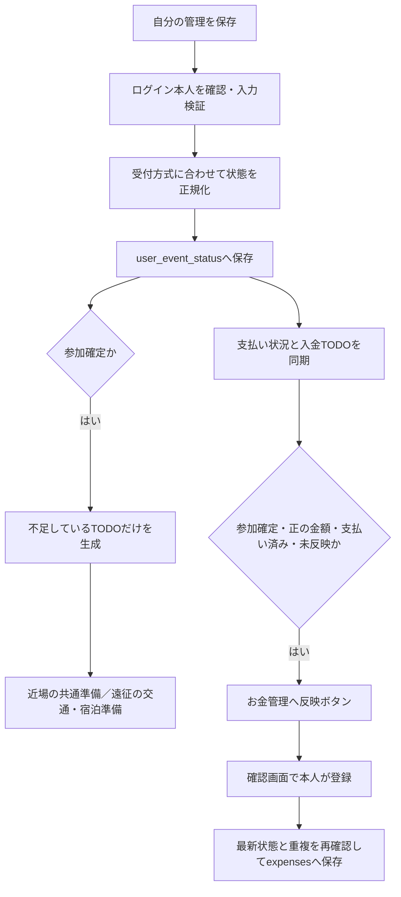

# イベント管理 Step 2 — 参加確定を基準にした準備管理

## 1. バックアップと移行済み状態

作業対象はOshilife v2（接続先oshilife_v2）。旧Oshilife・XAMPP全体・my.cnf・Event Scheduler・システムテーブルは変更していない。

移行前バックアップ：`/private/tmp/oshilife-v2-before-event-step2-20261001-231755.sql`。37,965バイト、終了コード0。mysqldumpに `--single-transaction --skip-events --skip-routines --triggers --hex-blob` を指定した。全21テーブルの定義・データ・INDEX・UNIQUE・外部キーを取得し、triggerは0件だった。

新規検証DB `oshilife_v2_step2_test_20261001_231755` に復元し、全行とSHOW CREATE TABLEが一致することを確認。検証DBで010を試してから元DBへ適用した。検証DBは削除していない。2026年10月2日の再開時に、010は再実行せず移行済みの状態を読み取り確認した。

## 2. migrationと既存データ

`database/migrations/010_event_participation.sql` を追加・適用済み。以前のmigrationは変更していない。既存ID・金額・支出反映元・外部キー・UNIQUE・TODOを維持する。

user_event_statusへ追加：

| 列 | 役割 | 初期値 |
|---|---|---|
| entry_method | 受付方式 | unknown |
| participation_status | 参加するか | considering |
| sales_type | 販売枠の種類 | none |
| legacy_lottery_status | 移行前の抽選・販売値の記録 | 新規データはNULL |

lottery_statusの初期値はnot_applicableへ変更した。許可値のCHECK制約も追加し、PHP側でも型・許可値を検証する。入力によるSQL組立てを避け、値はプリペアドステートメントへ渡す。

| 旧lottery_status | entry_method | 新lottery_status | participation_status | sales_type |
|---|---|---|---|---|
| pending | lottery | pending | considering | none |
| won | lottery | won | confirmed | none |
| lost | lottery | lost | not_attending | none |
| general_sale | unknown | not_applicable | considering | general_sale |
| production_release | unknown | not_applicable | considering | production_release |
| other | unknown | not_applicable | considering | other |

元の値はlegacy_lottery_statusに残す。一般販売・制作開放から購入済みを推測しない。updated_atも移行時は保持。既存本人管理2件に対してこの対応を検査し、変換部分だけを元に戻した全21テーブルの全行ハッシュが移行前と一致した。

既存件数：events 1、user_event_status 2、trips 1、todos 16、expenses 3。ID・ユーザー・イベントの関連・支出反映元を保持した。

## 3. 状態を分ける理由と具体例

- **受付方式**：抽選、先着、予約、申込不要、未確認。参加するための手続きの種類。
- **申込状況**：未申込、手続き中、申込済み、申込不要。手続きをどこまで進めたか。
- **抽選結果**：対象外、結果待ち、当選、落選。抽選を利用するときだけ必要。
- **参加状況**：検討中、参加確定、不参加、取消。準備を始める基準。
- **販売区分**：FC、一般販売、制作開放、公式先行、その他、なし。チケットをどの枠で申し込むか。
- **支払い状況**：未完了／支払い済み。参加できることと支払い済みは別の事実。

| 例 | 受付方式 | 申込 | 抽選 | 参加 | 金額 |
|---|---|---|---|---|---|
| 抽選LIVE | lottery | applied | won | confirmed | 有料 |
| 予約制舞台 | reservation | applied（画面は予約済み） | not_applicable | confirmed | 有料 |
| 先着イベント | first_come | applied | not_applicable | confirmed | 有料 |
| 無料展覧会 | no_application | not_required | not_applicable | confirmed | 0円 |

「当選」だけを基準にすると、抽選のないイベントでは準備を始められない。そのためTODO生成とチケット反映を参加確定へ統一した。新画面では参加状況を本人が明示的に選ぶ。抽選に落選しても別枠で参加できる場合は、本人が参加確定へ編集できる。

申込の保存値applyingは維持し、表示を手続き中に変更した。APIはin_progressも受け取りapplyingへ正規化する。DB内に二種類の同義値を増やさない。

## 4. 保存・TODO・支払いの流れ

サーバー側でも、非抽選はlottery_status=not_applicable、申込不要はapplication_status=not_requiredへ正規化する。許可されない値や配列等は拒否する。販売区分は申込不要ならnone。

参加確定なら移動未設定でも共通TODOを生成する。遠征選択時には交通・宿泊のTODOを追加する。テンプレートキーのUNIQUEを維持し、取消後の再確定でも二重生成せず、削除済みTODOも復活させない。既存TODOのタイトルを一括変更しない。

0円では支払いTODOを新規生成しない。既存の支払いTODOは履歴保持のため削除せず画面と未完了件数から除外する。他の準備と遠征は利用できる。0円は画面・反映元APIで支払い不要と表示するが、保存済みの支払い履歴は勝手に書き換えない。

チケット反映条件は **参加確定＋金額>0＋支払い済み＋ticket_expense_idがNULL**。入金TODO完了と直接の支払い状況変更は双方向に同期する。削除済み入金TODOは復活させず、必要な反映入口はTODO欄に残す。反映済み支出は本人の確認操作なしに変更しない。

source_idは引き続きuser_event_status.id。live_ticket保存値・特効換算・交通／ホテルの反映条件と重複防止は変更していない。既存の支払日が不明な場合も、単なるメモ編集で今日の日付を補わない。

## 5. UI・API・種類

登録・編集で6種類を選択できる。表示ラベルはconfig/events.phpで共通化。種類省略の旧編集APIでも既存event_typeを維持する。新規時のみカレンダーカテゴリの初期値をLIVE／イベントに設定し、以後event_typeとは独立して保持する。

受付方式によって抽選欄・申込欄・販売区分を出し分ける。予約では予約状況／予約済み、先着では申込／購入状況と表示する。0円では支払い選択を隠し「支払い不要」を表示する。販売区分は必要な場合に開く補助欄とした。

`/api/events/`を維持。status/update.phpはentry_method、application_status、lottery_status、participation_status、sales_type、trip_type、ticket_amount、ticket_payment_status、noteを扱う。detail/list/nextの本人欄にも新状態と表示ラベルを返す。

user_idはセッション（サーバー側のログイン記録）から取得し、リクエストで指定された他人のIDは使わない。TODO・遠征・支出反映元も本人IDで確認する。

旧lives APIと旧画面URLを維持。参加欄を持たない旧形式の当落更新はwon→confirmed、lost→not_attending等へ変換する。旧販売値はsales_typeへ保存し、元値も記録する。旧APIの応答だけは旧販売値を抽選欄に戻して互換表示する。新フォームでは明示した参加状況を優先する。

ホームは本人管理のある今日以降・開催予定／延期を対象に、不参加・取消を除外する。検討中を消さないため**日付順を維持**し、参加確定優先の並べ替えは行っていない。カードには参加状況を表示する。

## 6. 主な変更ファイル

| ファイル | 役割 |
|---|---|
| database/migrations/010_event_participation.sql | 既存本人管理の安全な状態移行 |
| database/schema.sql | 新規環境用の現在の構造 |
| config/events.php | 状態名・種類名・共通TODO |
| app/validators/event_validator.php | 種類と本人管理の型・許可値・互換変換 |
| app/services/event_service.php | 参加確定TODO・支払い同期・遠征作成 |
| app/repositories/event_repository.php | 本人状態と種類の取得・無料時のTODO件数 |
| app/helpers/event_api.php | ホーム取得条件 |
| app/repositories/money_repository.php | 参加確定を基準にした反映可否 |
| app/helpers/event_view.php / payment_view.php | TODO・支払い不要・反映済み表示 |
| app/helpers/legacy_event_api.php | 旧販売値の応答互換 |
| app/services/feedback_service.php | LIVE以外の予定でも修正提案できるよう整合確認 |
| public/event_form.php / event_detail.php | 種類選択と本人管理画面 |
| public/assets/js/events.js | 受付方式・金額による出し分け、状態カード |
| tests/event_step2_smoke.py | 種類別・権限・支払い・同期・ホーム・互換テスト |
| tests/event_test_support.py | HTTP認証・清掃・既存データ比較の共通部品 |
| tests/payment_import_smoke.py | 共通部品を利用する既存支払い回帰テスト |
| tests/events_browser.mjs | PC／スマホで表示と出し分けを検証 |
| tests/event_existing_readonly.php | 既存本人管理を種類に依存せず読み取り検証 |

## 7. 検証結果

- Step 2 HTTP：131項目。全6種類、申込方式、明示した参加状況、無料、直接支払い、TODO重複防止、交通・ホテル反映、二重反映409、他人の管理／TODO／遠征拒否、修正提案・リアクション・カレンダー・ホームを確認。
- 既存抽選LIVE・旧API：166項目合格（中断前に完了）。
- 支払い連携：151項目合格。
- お金管理：167項目合格。
- Chrome実ブラウザ：PC1440px／スマホ390pxの計20画面。種類別の本人管理・一覧・登録・ホーム・遠征・お金管理を確認し、受付方式別の表示、0円時の支払い非表示、横はみ出し・JS例外・リソースエラーなしを検証。画像も目視確認した。
- PHP252ファイルの構文検査、5本のJavaScript UI検証：合格。
- テストの一時データは清掃し、既存全21テーブルの元データ不変を確認。

## 8. 未実装・連番ルーム前の確認事項

会期全体・複数イベントをまとめた遠征・共同TODO／支出・精算・Chatは未実装。展覧会は来場日1回で管理する。特効換算とlive_ticketは変更していない。

現在の参加状況・TODO・遠征・支払いはすべて本人の記録。連番ルームでこれらをそのまま公開しないこと。共有参加者・編集権限・共同支出と個人支出の二重計上防止・返金と取消の扱いを、次Phaseの設計時に確定する。参加取消だけで既存支出や遠征を削除する処理は入れていない。
