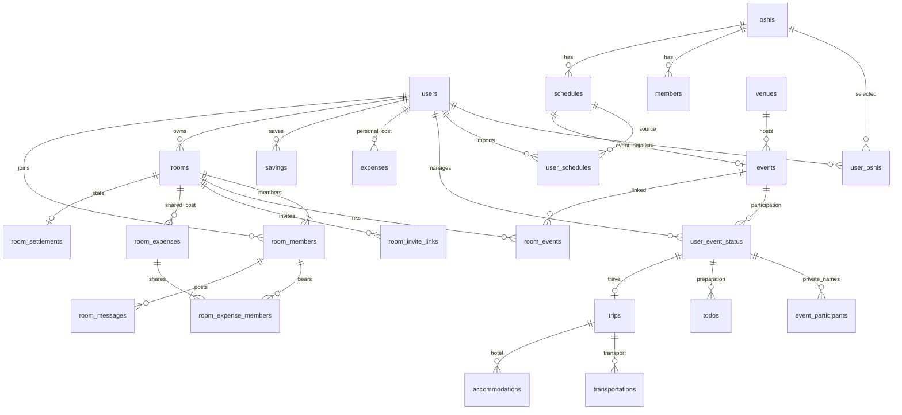

# Oshilife v2 現行仕様の棚卸し

確認日：2026年10月4日／対象コミット：`b6a0457`（お金周り完成）

卒業制作提出用仕様書の材料として、現在の主要画面・API・サービス、実DBのテーブル・列・外部キー、README、Step別報告書を照合した。過去の企画を実装済みとは扱わない。本書の作成ではコード・CSS・API・DBの変更、migration、データ更新を伴うテストを実施していない。動作検証の成績は既存報告書の記録であり、今回の再テスト結果ではない。

## 1. プロダクト概要

| 項目 | 現行仕様に基づく整理 |
|---|---|
| 名称 | Oshilife v2 |
| コンセプト | 推し活の予定・イベント・遠征・お金を、自分の推しを中心にまとめるWebアプリ |
| 画面上のメッセージ | 「好きがある、毎日。」「推しとの毎日を、自分らしく。」 |
| 主な対象ユーザー | 推しの予定を集めたい人、イベント参加の準備・費用を管理したい人、同行するOshilifeユーザーと会話や共同支出を共有したい人 |
| 対応する推し・活動 | アーティストに限定しない。グループ、ソロ、俳優、その他の推しと、LIVE・公演・舞台・展覧会等 |
| 現在の提供価値 | 公開情報の取り込み、個人の予定・準備・会計管理、ルーム内の会話・費用分担・精算確認を一つのアプリで扱える |

対象ユーザーと課題は、READMEの説明と利用可能な機能を基にした整理である。独自の市場調査、利用者数、実証済みの効果、制作者の個人的な企画背景は確認していない。

## 2. 解決する課題

- 推しごとの予定を探し、自分のカレンダーへ整理する手間。公開予定の取り込みと、共有元の変更を表示へ反映する仕組みで支援する。
- 申込・抽選・参加・支払いが混ざり、準備を忘れやすいこと。状態を分け、参加確定を基準にTODOを用意する。
- 交通・宿泊・支出が別々になりやすいこと。イベントに関連する遠征情報と、本人の会計への反映導線をまとめる。
- 複数人の参加で、支払者・負担者・返す金額が分かりにくいこと。ルーム内で共同支出と差引後の送金案を共有する。
- 画面の色が好みに合わないこと。本人の配色設定を用意する。

実際の予約・購入・銀行送金を代行するサービスではなく、情報と記録を管理するアプリである。

## 3. 実装済みの主要機能

API欄は実装側の`api/`からの相対表記。ブラウザー向けの入口は`public/api/`にも配置される。「本人」はログイン中のユーザーを指す。

| 大分類／小分類 | できること・利用者 | 主な画面 | 関連テーブル | 主なAPI群 |
|---|---|---|---|---|
| 認証／登録・ログイン | メールとパスワードで登録、ログイン、ログアウト | register、login | users | auth/register、login、logout、me |
| 推し／検索・登録 | 共有推しを検索し、自分の一覧へ追加・解除 | oshis | oshis、user_oshis | oshis/search、my、follow、unfollow |
| 推し／共有マスター | 新規作成、作成者による名前・種別・絵文字の編集、メンバー追加・カラー指定 | oshi_detail | oshis、members | oshis/create、update、members/create |
| 配色／本人設定 | 好きな画面色を保存し共通UIへ反映 | profile | user_settings | settings/theme |
| 予定／個人・公開 | 公開・非公開の登録、編集、削除、情報元と対象メンバーの指定 | schedule_form、schedule_detail | schedules、schedule_sources、schedule_members | schedules/create、update、delete、detail |
| カレンダー／月・日 | 月移動、推し絞り込み、日別予定、日付から登録 | calendar | schedules、user_schedules | schedules/calendar |
| 発見／取り込み・同期 | 公開予定検索、自分へ追加・解除、自分用編集 | discover、schedule_detail | schedules、user_schedules | schedules/public、add-to-calendar、remove-from-calendar、customize |
| フィードバック | 助かった・ありがとうの切替、修正提案、投稿者の承認・却下、共有状況集計 | schedule_detail、corrections、home | reactions、correction_requests、notifications | schedules/reactions、corrections、stats、reflections/monthly-summary |
| 通知 | 感謝・修正提案の受信ポップアップ、一覧、既読管理 | 共通ヘッダー | notifications | notifications/list、read |
| イベント／共有情報 | 6種類の登録・検索・編集、会場登録、作成者による別日程へのコピー | events、event_form、event_detail | events、schedules、venues | events/list、create、update、detail、duplicate-check、venues |
| イベント／本人の参加 | 受付・申込・当落・参加・販売区分・支払い・近場／遠征の管理 | event_detail | user_event_status | events/status、status/update |
| TODO／準備 | 参加確定時の不足分生成、追加・編集・完了・論理削除 | event_detail、trip_detail | todos | events/todos |
| 遠征／交通・宿泊 | 本人の遠征まとめ、交通・ホテルの予約・支払い記録 | trip_detail、travel_form | trips、transportations、accommodations | trips、trips/transport、trips/accommodation |
| 個人会計／積立・支出 | 登録・編集・削除、残高、年・月・カテゴリ・推し別集計、特効換算 | money、saving_form、expense_form | savings、expenses | money/savings、expenses、dashboard、monthly、categories、by-oshi、special-effects |
| 支払い連携 | 本人のチケット・交通・ホテルを確認後に会計へ反映 | TODO欄、trip_detail、expense_form | user_event_status、transportations、accommodations、expenses | money/source、expenses/create |
| 個人同行者 | 自分だけの名簿、名前・メモ編集、利用終了・再開 | event_companions | event_participants | events/companions |
| 連番ルーム／参加 | 作成、名前変更、複数イベント紐付け、リンク招待、参加、退出、終了 | rooms、room_detail、rooms/join | rooms、room_members、room_events、room_invite_links | rooms、rooms/events、links、members |
| 共同支出／負担 | 支払者1人・負担者複数、均等割り・個別負担、編集・取消 | room_detail内／共同支出各画面 | room_expenses、room_expense_members | rooms/expenses/list、detail、members、create、update、cancel |
| 精算／サマリー・完了 | 差引後の送金案、ownerによるルーム全体の精算済み記録 | room_detail | 上記共同支出2表、room_settlements | rooms/expenses/settlement-summary、mark-settled |
| Chat／トーク | 参加中メンバーのテキスト会話、本人削除、定期取得 | room_detail | room_messages | rooms/messages/list、send、delete |
| 共同支出から個人会計 | 精算済みの本人負担を確認して反映・更新・削除 | room_detail、money | room_expense_members、room_expenses、room_settlements、expenses | rooms/expenses/personal |

初期マスター投入用のCSV CLIも存在する。`scripts/import_masters.php`は推し・メンバーの検証と明示投入用で、利用者向けの会計CSVインポート／エクスポート機能ではない。

## 4. 主要画面一覧

実体のある画面は**26画面**（登録／編集兼用フォームは1画面、旧来の共同支出専用3画面も含む）。そのうち現在の主導線は23画面で、共同支出の操作は主にルーム詳細内で完結する。別途、indexの振り分け1入口、旧LIVE互換3入口、動的CSS1ファイルがある。APIやダイアログ内の同一フォームを重複して数えない。

ファイルは`public/`からの相対パス。以下の「要」は共通helper経由の認証も含む。

| 画面名／ファイル | 目的・主な操作 | 主な遷移元 → 遷移先 | ログイン |
|---|---|---|---|
| 新規登録／register.php | 表示名・メール・パスワード登録 | ログイン → ログイン | 不要 |
| ログイン／login.php | 認証 | index・認証が必要な画面 → ホーム／招待確認 | 不要 |
| ホーム／home.php | 今日の予定、未追加情報、次のイベント、資金、ありがとう | ログイン・ナビ → 各詳細・推し管理・会計 | 要 |
| カレンダー／calendar.php | 月・日別表示、推し絞り込み、日付から登録 | ナビ・ホーム → 予定登録・詳細 | 要 |
| 見つける／discover.php | 公開予定の検索・取り込み | ナビ・ホーム → 予定詳細・共有登録 | 要 |
| 予定詳細／schedule_detail.php | 詳細、取り込み、自分用編集、感謝・提案 | カレンダー・検索 → 予定編集・イベント詳細 | 要 |
| 予定登録・編集／schedule_form.php | 公開／非公開予定、自分用編集 | カレンダー・詳細 → 予定詳細等 | 要 |
| 届いた修正提案／corrections.php | 承認・却下・履歴確認 | マイページ・通知・ホーム → 関連予定 | 要 |
| 推し管理／oshis.php | 自分の一覧、検索、作成、登録解除 | ホーム・マイページ → 推し詳細 | 要 |
| 推し詳細／oshi_detail.php | 推し編集、メンバー追加とカラー | 推し管理 → 推し管理 | 要 |
| イベント一覧／events.php | 検索、本人管理状況の確認 | ナビ・ホーム → 登録・詳細・ルーム | 要 |
| イベント登録・編集／event_form.php | 種別・日時・会場・開催状態、コピー | 一覧・詳細 → イベント詳細 | 要 |
| イベント詳細／event_detail.php | 共有情報、自分の参加・支払・TODO | 一覧・カレンダー → 同行者・遠征・予定・ルーム一覧 | 要 |
| 同行者／event_companions.php | 個人用の同行者名簿 | イベント詳細 → イベント詳細 | 要 |
| 遠征まとめ／trip_detail.php | 日程、交通、宿泊、TODO | イベント詳細 → 交通／宿泊編集・個人支出 | 要 |
| 交通・ホテル登録編集／travel_form.php | 予約・金額・支払い記録 | 遠征まとめ → 遠征まとめ | 要 |
| お金管理／money.php | 残高・集計・特効・記録一覧 | マイページ・ホーム → 積立／支出フォーム | 要 |
| 積立登録編集／saving_form.php | 本人の積立管理 | お金管理 → お金管理 | 要 |
| 支出登録編集／expense_form.php | 本人支出・支払い反映の確認 | お金管理・TODO・遠征 → お金管理 | 要 |
| マイページ／profile.php | 本人情報、色設定、ログアウト | ナビ → 推し管理・修正提案・お金管理・ログイン | 要 |
| 連番ルーム一覧／rooms.php | 参加中ルームの一覧・作成 | イベント一覧／詳細 → ルーム詳細 | 要 |
| ルーム詳細／room_detail.php | イベント、メンバー、トーク、お金、管理 | ルーム一覧・参加確認 → イベント詳細等 | 要 |
| 招待確認／rooms/join.php | 招待内容の確認・明示参加 | 招待URL → ログイン／ルーム詳細／一覧 | 要・未認証時はログインへ |
| 共同支出一覧／room_expenses.php | 独立ページでの一覧・取消履歴 | 互換の専用画面導線 → 詳細・フォーム・ルーム | 要 |
| 共同支出詳細／room_expense_detail.php | 支払・負担内訳、編集・取消 | 専用一覧 → 専用フォーム | 要 |
| 共同支出登録編集／room_expense_form.php | 支払者・内訳入力、均等割り | ルーム内dialog／専用画面 → 保存後に一覧更新 | 要 |

`index.php`はセッションの有無でhome/loginへ振り分け、ホーム側でも本人の有効性を確認する。`live.php`、`live_detail.php`、`live_form.php`は認証後に新イベント画面へ移す互換入口。`theme.css.php`は配色CSSの配信で、独立した操作画面ではない。

## 5. 主要画面遷移

```text
新規登録 → ログイン → ホーム
共通ナビ：ホーム｜カレンダー｜見つける｜イベント（♫）｜マイページ

ホーム → 今日の予定／カレンダー → 予定詳細
カレンダーの日付 → その日付を設定した予定登録
カレンダーの件数 → 日別一覧 → 予定詳細
見つける → 公開予定詳細 → 自分のカレンダーへ追加

イベント → イベント詳細 → 自分の参加管理・TODO
                         ├ 同行者管理（自分だけ）
                         ├ 遠征まとめ → 交通・ホテル
                         ├ 予定詳細・修正提案
                         └ 連番ルーム一覧 → ルーム詳細

招待リンク → 未ログインならログイン → 招待確認 →「参加する」→ ルーム詳細
ルーム詳細：イベント → メンバー／招待 → トーク → お金 → ルーム管理
お金：共同支出入力 → 精算サマリー → ownerが精算済みにする
     → 各本人が自分の負担額を個人会計へ反映

マイページ → 推し管理／修正提案／色設定／お金管理
個人のTODO・交通・ホテル → 支払い反映の確認 → 個人支出
```

## 6. DBテーブル一覧と役割

実DB `oshilife_v2`の列・主キー・外部キーを読み取り確認し、**31テーブル**を確認した。以下の「公開」はアプリ内の共有情報を意味し、未ログインのインターネット利用者へ無条件公開する意味ではない。

PK＝主キー（行を識別）、FK＝外部キー（参照先との整合性を守る制約）。共通の作成／更新日時は主要列から省略する。

| テーブル | 役割・主要列 | PK | 主なFK・関連 | 区分 |
|---|---|---|---|---|
| users | 表示名、email、password_hash、deleted_at | id | 個人情報の起点 | 個人 |
| user_settings | user_id、theme_color、accent_color | id | users、user_id一意 | 個人 |
| oshis | name、oshi_type、emoji、created_by_user_id、is_active | id | 作成者users | 公開共有マスター |
| members | oshi_id、name、color_name、heart_emoji、hex_color | id | oshis | 公開共有マスター |
| user_oshis | user_id、oshi_id、registered_at | id | users・oshis | 個人 |
| schedules | 作成者、推し、title、category、日付・時刻、visibility、status、note | id | users・oshis | 公開／個人をvisibilityで区別 |
| schedule_members | schedule_id、member_id | id | schedules・members | 予定の公開範囲に従う |
| schedule_sources | schedule_id、source_type、source_url、note | id | schedules | 予定の公開範囲に従う |
| user_schedules | user_id、schedule_id、sync_enabled、custom_* | id | users・schedules | 個人の取り込み・上書き |
| correction_requests | schedule_id、提案者、field_name、old_value、new_value、reason、status | id | schedules・users | 提案者／投稿者向け履歴、公開表示は必要な状態等に限定 |
| reactions | schedule_id、user_id、reaction_type | id | schedules・users | 公開予定の反応。件数と本人選択を表示 |
| notifications | recipient_user_id、actor_user_id、kind、event_key、shown_at、read_at | id | users・schedules・correction_requests | 受信者本人 |
| venues | name、prefecture、address、latitude、longitude | id | eventsから参照 | 公開共有マスター |
| events | schedule_id、event_type、venue_id、open_time、status | id | schedules（一意）・venues | 共有イベント |
| user_event_status | user_id、event_id、受付・申込・抽選・参加・販売区分、trip_type、チケット金額・支払・反映先 | id | users・events・expenses | 個人 |
| event_participants | user_id、event_id、name、note、self_marker、archived_at | id | (user_id,event_id)→user_event_status | 個人同行者 |
| trips | user_id、event_id、trip_name、departure_date、return_date、note | id | (user_id,event_id)→user_event_status | 個人遠征 |
| todos | user_id、event_id、trip_id、title、due_date、is_completed、template_key、deleted_at | id | 本人管理と遠征への複合FK | 個人 |
| transportations | trip_id、移動手段、発着地・日時、amount、予約・支払状態、expense_id | id | trips・expenses | 個人 |
| accommodations | trip_id、hotel_name、入退館日時、amount、予約・支払状態、expense_id | id | trips・expenses | 個人 |
| savings | user_id、oshi_id、amount、saving_date、note | id | users・oshis | 個人会計 |
| expenses | user_id、oshi_id、event_id、trip_id、title、category、amount、expense_date、special_effect_eligible、source_type、source_id | id | users・oshis・events・trips | 個人会計 |
| rooms | owner_user_id、name、status | id | users | ルーム共有 |
| room_members | room_id、user_id、room_owner_user_id、role、status、owner_marker、joined_at | id | roomsへの複合FK・users | ルーム共有／退出履歴 |
| room_events | room_id、event_id | id | rooms・events | ルーム共有 |
| room_invitations | room_id、inviter_user_id、invited_user_id、status、pending_marker | id | roomsへの複合FK・users | 旧方式の招待履歴のみ |
| room_invite_links | room_id、発行者、token_hash、expires_at、max_uses、used_count、status | id | rooms・ownerの複合FK | owner管理・秘密情報 |
| room_expenses | room_id、登録者／支払者と保存名、title、category、total_amount、expense_date、note、status、version | id | 登録者・支払者→room_membersの複合FK | ルーム共有 |
| room_expense_members | room_expense_id、room_id、user_id、保存名、share_amount | id | 共同支出・メンバーへの複合FK | ルーム共有 |
| room_settlements | settlement_status、settled_at、settled_by_user_id | room_id | rooms・同ルームのroom_members | ルーム共有 |
| room_messages | room_id、user_id、display_name_snapshot、message、status | id | (room_id,user_id)→room_members | ルーム共有 |

重要な制約・注意：

- 本人の推し登録・予定取り込み・イベント管理はユーザーと対象IDの組で重複を防ぐ。
- `event_participants`の`UNIQUE(user_id,event_id,self_marker)`で自分は1件。同名の同行者は許可し、IDで識別する。
- `room_members`は同一ルーム・ユーザーが一意。`room_events`も同じイベントの二重紐付けを防ぐ。
- `room_expense_members`は同じ支出・ユーザーが一意。内訳合計と総額の一致はサービス側でも検査する。
- `expenses`は`UNIQUE(user_id,source_type,source_id)`で同じ元記録の二重反映を防ぐ。`source_id`は種類によって参照先が変わるアプリ上の関連で、直接FKではない。
- `expenses.room_expense_id`は残存する未使用列。現行連携は`source_type='room_expense'`と`source_id`を使用し、その列へは保存しない。
- `oshis.theme_color`も互換用に残るが、推し本体のテーマカラー入力はない。本人の画面色とメンバーカラーは別仕様。
- migration管理テーブルはない。連番SQLと実テーブル構造で適用状態を把握する。最新の追加テーブルは016のroom_messagesで、個人会計反映では新migrationを作っていない。

## 7. 主要なテーブル関係

```text
users → user_oshis ← oshis → members
oshis → schedules → schedule_sources / schedule_members
users → user_schedules ← schedules（共有元と本人の表示設定を分離）
schedules → events ← venues（イベントは予定1件に対応）
users → user_event_status ← events
user_event_status → event_participants / todos / trips
trips → transportations / accommodations
users → savings / expenses

users → rooms（owner）
rooms → room_members ← users
rooms → room_events ← events（複数イベントを紐付け可能）
rooms → room_expenses → room_expense_members
room_members → 共同支出の登録者・支払者・負担者／room_messages
rooms → room_settlements（現在の精算状態は最大1件）
共同支出＋本人負担 → 明示操作 → expenses（本人の記録のみ）
```

簡易ER図。業務上の関連を示し、複合FKや全列は省略する。共同支出からexpensesへの線は直接FKではなく、source_type/source_idによるアプリ上の関連である。



## 8. 権限・公開範囲

認証（誰かを確認）と認可（その操作をしてよいか確認）を分ける。URLのIDや送信されたuser_idだけでは権限を与えない。

| 対象 | 閲覧・操作の範囲 |
|---|---|
| 個人情報 | 本人の設定、非公開予定、取り込み上書き、申込・当落・支払い、TODO、遠征、同行者、積立・支出は本人限定 |
| 共有推し・メンバー | ログインユーザーが閲覧。推し編集とメンバー追加は推し作成者 |
| 公開予定・イベント | ログインユーザーが共有情報を閲覧。共有元の編集は投稿者。修正提案は投稿者が承認・却下 |
| 個人同行者 | 本人が管理しているイベントにだけ登録可能。公開イベントを閲覧できるだけでは登録権にならない。他ユーザーやルームへ自動公開しない |
| ルーム閲覧 | status=activeの参加メンバーのみ。退出者は過去に参加していても閲覧不可 |
| owner操作 | ルーム名変更、イベント追加・除外、招待リンク発行・一覧・無効化、ルーム終了、精算済み確定 |
| 共同支出 | activeルームのactiveメンバーが作成。編集・取消は参加中の登録者本人またはowner。他メンバーは閲覧 |
| Chat | 進行中ルームのactiveメンバーが投稿。削除は投稿本人だけ。ownerも他人の投稿は削除不可 |
| 個人会計反映 | 本人だけ。ownerでも他人の個人支出・反映状態を取得／操作できない |

終了（closed）ルームでは、共同支出の追加・編集・取消とChat投稿・削除は不可。activeメンバーは履歴を閲覧でき、ownerの精算済み確定、本人の個人会計反映、招待リンク無効化、memberの退出は可能。単純に「すべての操作が禁止」とは記載しない。

## 9. 主要ロジック

### 9.1 公開予定の取り込みと同期

```text
公開予定を選ぶ → 追加API → ログイン本人と公開範囲を確認
→ user_schedulesに本人と元予定の関連を保存（sync_enabled=1）
→ カレンダー取得時に共有元の最新値を表示
```

同期は元情報を参照する仕組みで、各ユーザーへ毎回同じ予定をコピーして更新する方式ではない。

```text
自分用編集 → 本人の取り込み行を確認
→ sync_enabled=0、custom_*へ本人の値を保存
→ 本人には個別値を表示、共有元や他人の予定は変更しない
```

同期再開専用ボタンはなく、取り込み解除→再追加で共有元へ戻す。自分の元予定削除は論理削除で、他人の共有元を削除する操作とは区別する。イベントに紐付く共有情報はイベント側の編集処理を使う。

### 9.2 イベント種類・コピー・参加準備

現行の種類は次の6つ。

| 保存値 | 画面表示 |
|---|---|
| live | LIVE |
| performance | 公演 |
| event | イベント |
| sports | 舞台 |
| exhibition | 展覧会 |
| other | その他 |

`sports`は互換性のため残した内部値であり、現行の表示に「試合」はない。1日・1回ごとの登録で、展覧会も行く日を登録する。ツアー・会期全体の一括管理ではない。

作成者は「コピーして別日程を登録」で基本情報をフォームへ引き継ぎ、日付・時刻・会場等を変更して別IDのイベントを作れる。開催状態は開催予定に戻す。元イベントは変更せず、同行者・申込状況・TODO・支払い情報はコピーしない。

受付方式、申込状況、抽選結果、参加状況、販売区分、支払状況を分離する。「ファンクラブ先行受付」は画面の選択肢で、保存時には`entry_method=lottery`と`sales_type=fanclub`へ正規化する。抽選なしは抽選対象外、申込不要は申込不要の状態に揃える。

```text
本人管理を保存 → 入力・権限確認 → user_event_status
→ 参加確定なら不足するテンプレートTODOを追加
→ 近場は通常6項目／遠征は通常8項目
```

0円は支払い不要として入金TODOを生成対象から外す。未入力の金額と0円は区別する。固定のtemplate_keyで重複生成を防ぎ、削除したTODOを勝手に復活させない。参加状態や近場／遠征を変えても既存の予約・TODOを一括削除しない。遠征まとめは参加確定＋遠征の本人が作成し、1人1イベント1件、交通・ホテルは複数登録できる。

ホームの次のイベントは本人管理と開催状態を基準に表示し、不参加・取消等を除く。旧LIVEの当落値だけを基準にする説明は採用しない。

### 9.3 同行者

本人のイベント管理 → 同行者名・メモを保存 → 必要時に「自分」の行を作成 → 同行者行を保存。GETでは自分の行を作らず仮表示する。同名を許可し、自分は重複・利用終了不可。同行者の利用終了はarchived_atで管理し、再開できる。ルームメンバーとは別の個人名簿である。

### 9.4 フィードバック・通知

修正提案はpendingで保存し、投稿者が承認すると元予定の対象項目と履歴を一緒に更新する。提案後に元の値が変わった場合は上書きを拒否する。自分用編集の値は維持する。

「助かった」「ありがとう」は本人の同種反応を追加／解除する。共有状況は現在残る取り込み・反応から集計する。通知は感謝・修正提案向けで、画面表示中に約20秒ごとに確認する。ポップアップは最大3件、12秒後に消え、未読は通知一覧へ残る。Chatのプッシュ通知ではない。

## 10. お金管理仕様

### 10.1 個人会計

| 項目 | 現行仕様 |
|---|---|
| 積立 | 本人のsavings。共通積立（推し未指定）と推し別積立 |
| 支出 | 本人のexpenses。日付・カテゴリ・金額・メモ・関連情報 |
| 前年繰越 | 選択年の1月1日より前の積立合計－支出合計 |
| 現在残高 | 前年繰越＋選択年の積立－選択年の支出。銀行残高の自動取得ではない |
| 集計 | 年間、月別、カテゴリ別、推し別。推し絞り込み時の共通積立は自動配分しない |
| 金額 | 個人会計はDECIMAL(12,2)。共同支出は整数円 |
| 特効換算 | special_effect_eligibleが対象の個人支出を基準に計算する遊びの目安 |

特効対象の初期値はチケット・入場料、グッズ、CD、DVD／Blu-ray、ファンクラブ、有料配信、その他推し活。手数料、交通、宿泊、食事、観光、その他遠征は対象外。炎100円、CO₂300円、銀テ4,000円というアプリ独自の基準を使い、実際のライブ演出費とは異なる旨を表示する。外部相場を取得する機能ではない。

### 10.2 個人の支払いからの反映

チケットは参加確定・正の金額・支払い済み、交通／ホテルは予約済み・支払い済み・正の金額等を検査する。条件を満たしても自動計上せず、本人が確認画面から登録する。

```text
支払い完了 → 反映ボタン → 金額・日付等を確認
→ 所有者・最新状態・重複を再確認 → expensesと元の反映先IDを保存
```

チケットのsource_idはイベントIDではなくuser_event_status.id。交通／ホテルは予約行のIDを用いる。個人支出を削除すると元のexpense_id等は外部キーのSET NULLで解除され、条件を満たせば再反映できる。元予約の変更・削除で個人支出を自動上書き・削除しない。

### 10.3 共同支出と実質負担

| 記録 | ホテル20,000円を自分が払い、各人10,000円負担する場合 |
|---|---|
| room_expenses.total_amount | 支払総額20,000円、支払者は自分 |
| room_expense_members.share_amount | 自分10,000円、相手10,000円 |
| 精算サマリー | 他の支出がなければ相手→自分へ10,000円 |
| 本人のexpenses | 精算済み後に本人が反映した10,000円だけ |

立替返金をsavingsやマイナス支出として記録しない。共同支出の登録や精算済み操作だけでは個人会計は変わらない。そのため、未反映の本人負担や一時的な現金流出まで個人会計の残高が自動表示するわけではない。

反映にはactiveメンバー、有効な共同支出、正の本人負担、精算済みが必要。0円・負担者でない場合は新規反映できない。支払者が他人でも本人負担があれば反映できる。

元の変更後も本人支出を自動更新しない。差分を案内し、再精算後に本人が更新する。取消・負担解除後も本人が明示削除する。個人側で削除後は条件を満たせば再反映可能。退出後はルーム経由の操作はできないが、保存済み本人支出は個人会計側で編集・削除できる。

共同支出のticket→live_ticket、other→other_trip、その他の5種類は既存の同名カテゴリへ対応付ける。特効はチケット・グッズの本人負担だけが対象。イベントが1件で公開情報と本人の登録推しを確認できる場合のみ新規反映に関連付け、複数イベントなら推測せずevent_id／oshi_idをNULLにする。

重複防止の単位は「元の共同支出ID＋本人」。同じ実際の費用を手入力や従来の予約連携ですでに登録したかまでは自動判定しない。

## 11. 連番ルーム・共同支出・精算

### 11.1 ルームと招待

作成時にowner自身もメンバーとして登録する。ownerが自分の管理中の公開イベントを複数紐付けできる。紐付けはroom_eventsの関連だけで、参加者の個人カレンダー・当落・TODO・遠征を自動作成／公開しない。

招待は32バイトの乱数から作るリンクで、有効期間は7日。DBにはSHA-256ハッシュだけを保存し、生URLは発行時だけ返す。複数人に利用可能で、現在のUIでは人数上限を設定しない。複数リンクは独立し、再発行だけでは前のリンクは失効しない。期限切れ、ownerの無効化、ルーム終了で参加を止める。期限はアクセス時に確認し、Event Schedulerに依存しない。

URLを開くだけでは参加せず、ログイン後の確認画面で「参加する」を押す。既参加者は重複登録せず、退出後の再参加は同じメンバーIDを再利用する。ownerは退出できず、owner移譲・終了ルーム再開は未実装。memberの退出後も過去の支払・負担・投稿を保持する。

### 11.2 共同支出

カテゴリはチケット、交通、宿泊、食事、グッズ、観光、その他の7種類。支払者は1人、負担者は1人以上。総額は1〜999,999,999円、個別負担は0円を許可する。支払者が負担者に含まれない記録も可能。

均等割りは整数除算し、余りの1円を負担者に含まれる支払者から優先し、残りはroom_members.id順に配る。例：10,000円÷3人＝3,334／3,333／3,333円。均等割り後の個別変更も可能。合計不一致はサーバーで拒否する。

支出本体と負担内訳をトランザクション（一組として成功／失敗させる処理）で保存する。versionで古いフォームによる上書きを防ぐ。取消はstatus変更で履歴を残す。退出者を新たな負担者等に追加できず、既存の退出者の負担額は固定して保持する。名前は記録時のsnapshotを持つ。

### 11.3 精算サマリー・精算済み

```text
有効な共同支出と内訳を取得 → 合計一致を確認
→ 各人の「支払総額－負担総額」を計算
→ プラスは受取、マイナスは支払
→ 差額を相殺し「あなた → 相手に支払う／金額」を表示
```

ホテルをAが20,000円、交通をBが12,000円支払い、どちらも半分ずつ負担なら、Aは＋4,000円、Bは－4,000円、BからAへ4,000円の案になる。

取消済みは計算対象外。退出者も過去の有効な支払・負担があれば計算対象。同額時はID順など固定順序を使い、同じ記録から同じ結果を出す。数学的に最少の送金件数を保証する方式ではなく、3人以上では元の立替相手と異なる送金経路へまとめる場合がある。不整合はエラー表示し、誤った「精算不要」を出さない。

ownerだけがルーム全体を精算済みにできる。room_settlementsには現在状態・日時・操作者を保存し、送金案そのものや送金履歴は保存しない。支出0件では確定不可、支出あり差額0円は確定可能。精算済みはownerの完了宣言であり、銀行送金を検証しない。

精算済み後に支出を追加・編集・取消する場合は警告確認を求め、保存成功と同時に未精算へ戻す。フォームを開く・キャンセル・入力不備・保存失敗だけでは解除しない。部分精算、個々の送金ごとの完了記録、銀行決済は未実装。

## 12. Chat仕様

| 項目 | 現行仕様 |
|---|---|
| 保存先 | room_messages。投稿者と投稿時の表示名、本文、状態、日時 |
| 形式 | テキストのみ。日本語・改行・絵文字・URL文字列。URLはリンク化しない |
| 文字数 | 最大1,000文字。空白のみ、不正形式等を拒否 |
| 初期履歴 | 直近100件を時系列で表示。画面に保持する件数も100件 |
| 定期取得 | 通信完了から4秒後に次の取得。大量の未取得分がある場合は短い間隔で追いつく |
| after_id | 最後に取得した投稿IDより後だけ取得する目印。送信応答だけで進めず、取得応答で更新 |
| 削除の反映 | 表示中のknown_idsを最大100件送り、削除済みIDの通知で本文を置換 |
| 画面非表示 | 新たな定期取得を停止し、戻ったら差分取得 |
| スクロール | 初回・自分の送信後は末尾。過去ログ閲覧中は強制移動せず新着ボタン |
| 削除権限 | 進行中ルームのactiveメンバーで投稿者本人のみ。論理削除し、削除本文はAPIへ返さない |
| closed | activeメンバーは閲覧のみ。投稿・削除不可 |
| 退出 | 閲覧・投稿・削除不可。残ったメンバーには過去投稿が残る |
| 連投制限 | 同一ユーザーの全ルーム合計で30秒間に20件。削除済み投稿も含む |
| 会計との関係 | Chat操作では共同支出・精算状態・個人会計を変更しない |

short pollingは、ブラウザーが定期的にサーバーへ新着を問い合わせる方法。WebSocketによる常時接続ではない。古い100件より前の追加読み込み、既読・未読、画像・ファイル・音声、メンション、Chat通知は未実装。通信切断時に送信結果が不明な場合の厳密な重複排除も未実装で、自動再送しない。

## 13. セキュリティ

- パスワードはpassword_hashでハッシュ化し、password_verifyで照合。平文保存しない。
- ログイン成功時にsession_regenerate_idでセッションIDを交換する。本人IDはサーバー側セッションから取得する。
- 独立したセッション名・保存先、HttpOnly、SameSite=Lax、strict mode、2時間の無操作期限を設定。Secure Cookieは本番設定またはHTTPS時に有効。
- ログイン必須画面は未認証時にログインへ移動し、APIは401を返す。有効なユーザーかDBでも確認する。
- 更新APIはCSRFトークンを照合し、別サイトからの意図しない操作を防ぐ。
- PDOのプリペアドステートメントでSQL命令と入力値を分離。PDOのエミュレートprepareは無効。
- PHPはe()／htmlspecialchars、Chat等のJavaScriptはtextContentで文字として表示し、入力をHTMLとして実行しない。
- 本人IDと対象ID、room_idと支出／投稿IDの組合せで認可する。IDを変えるだけで他人の記録へアクセスできないようにする（IDOR対策）。
- owner／member、active／left、active／closedをサーバー側で確認する。ボタンの表示制御だけに依存しない。
- 招待は乱数token、ハッシュ保存、7日期限、無効化、確認後のPOST参加。ログイン復帰先は固定招待パスで、任意URLへ転送しない。
- 認証はIP単位で15分30回の制限。Chatはユーザー単位の全ルーム合計制限とDBロックを使う。
- 共通処理にCSP、nosniff、no-store等を設定。招待画面はno-referrer。
- .envに環境設定を分離し、プロジェクト直下はApacheアクセス拒否、publicのみ許可する構成。
- 共同支出・精算・個人反映はトランザクション、ロック、確認値の照合、UNIQUE制約で不整合・二重操作を防ぐ。

これらは実装されている対策の整理であり、第三者による脆弱性診断合格や本番環境の安全性を保証する記述ではない。

## 14. 技術構成

| 層 | 確認できた構成 |
|---|---|
| Frontend | HTML、CSS（Grid／Flexbox／メディアクエリ）、素のJavaScript、fetch、JSON、dialog |
| Backend | PHP。画面、API、service、repository、validator、middlewareを分離 |
| DB接続 | PDO／pdo_mysql、utf8mb4、接続単位の日本時間設定 |
| 実DB | MariaDB 10.4.28。MySQL互換のDBとしてXAMPPから利用 |
| PHP実体 | XAMPP CLIでPHP 8.2.4を確認 |
| ローカル | macOS、XAMPPのApache／MySQL。README上のApache想定は2.4 |
| ライブラリ | 製品画面は外部CDN・フロントエンドフレームワークに依存しない構成 |
| テスト・補助 | PythonのHTTP検証、PHPの制約・計算検証、JavaScript／ブラウザー検証、PHP CLIのCSV投入 |
| 環境設定 | .env、APP_URL、共通URL生成関数。アセットURLへ内容ハッシュを付ける |
| 公開想定 | publicをDocumentRootにする構成をREADMEで推奨。外部共有時は到達可能なHTTPS URLが必要 |

作業ソース：`/Applications/XAMPP/xamppfiles/htdocs/oshilife/oshilife`。
README記載のlocalhost入口：`http://localhost/oshilife-v2/public/`。`htdocs/oshilife-v2`を同じソースへのシンボリックリンクとする構成で、別コピーの二重管理ではない。本番サービス名や本番公開済みであることは確認していない。iOS／Androidネイティブアプリは未実装。

## 15. PC／スマホ対応

- 共通ナビはスマホで下部固定。幅1,200px以上ではヘッダー内の横並びへ切り替える。中間幅は下部ナビを維持する。
- カレンダーは月表示と日別予定をPCで並べ、狭い画面で縦配置する。日付に「＋登録」は付けず、日付を押して登録へ進む。0件は表示せず、件数は補助表示。選択日の背景は件数まで含める。
- イベントのフォーム・カードは広い幅で複数列、スマホで1列。TODOも縦配置へ切り替える。
- ルームはイベント・メンバー・トーク・お金の順序を維持。複数イベントは狭い幅で横スクロール、招待・管理は折りたたみ。
- 共同支出の追加・編集はルーム内dialogで行い、保存後はお金領域だけ更新する。Chatは再初期化しない。独立画面も残る。
- Chat履歴はPC400px、スマホ350pxの内部スクロール。長文を折り返し、本人は右、他者は左。本人テーマの色を使用する。
- お金管理はPCで複数列、スマホで縦配置し、数値・棒グラフ・詳細を表示する。

今回の確認は構成と既存検証記録の確認まで。全端末・全ブラウザーの表示保証ではない。

## 16. 実装済み／未実装／将来候補

### 現在実装済み

認証、推し・メンバー管理、本人配色、個人／公開予定、カレンダー、取り込み・同期・個別編集、修正提案・感謝・通知、イベント6種類・コピー・FC先行、本人参加・TODO・遠征、個人同行者、個人会計・特効、支払い連携、連番ルーム・リンク招待・参加退出、共同支出・均等割り、精算サマリー・精算済み、Chat、本人負担の個人会計反映。

### 現時点で未実装（提出時に完成機能として記載しない）

- ツアー・会期全体の一括管理、繰り返しイベントの一括生成。
- 共同TODO・共同遠征・共同積立。個人のTODO／遠征をルームへ自動共有する機能。
- 部分精算、送金ごとの履歴、銀行／決済サービス連携、実際の送金。
- owner移譲、owner退出、メンバー強制退出、終了ルームの再開。
- Chatの画像・ファイル・音声、既読・未読、メンション、通知、100件より前の追加読み込み、WebSocket。
- 共同支出と個人会計の自動同期、他人の会計への代理反映、別の登録経路を横断する同一費用の自動検出。
- 個人同行者の名簿からOshilifeユーザーへの自動紐付け・招待。
- メール確認、パスワード再設定、アカウント編集・退会の一般利用者向け操作画面。
- 推しメンバーの編集・無効化画面、推し活の足あと・年末振り返り、会場周辺スポット機能。
- ネイティブアプリ、一般利用者向け会計CSV入出力。

### 将来拡張候補（実装の約束ではない）

共同TODO／遠征、精算履歴、owner移譲、会期単位の管理、Chat履歴・通知、会計の重複確認支援、アカウント管理、公開運用・モバイルアプリ化。優先順位と権限・データ移行は別途設計する。

## 17. 古い記載との相違・提出時の注意

| 古い記載・残る内部名称 | 現在仕様として採用する説明 |
|---|---|
| LIVE管理・次のライブ | UIはイベント管理・次のイベント。音符アイコンは維持 |
| event_typeのsports＝試合 | 現行ラベルは舞台。保存値sportsは互換目的で維持 |
| 当選したらTODO／チケット反映 | 現行は参加確定を基準にし、抽選なし・無料にも対応 |
| Step 3-2の表示名検索招待 | リンク招待へ置換済み。旧6 APIは認証後410、room_invitationsは履歴保存のみ |
| ROOM_UI_REDESIGNのChat準備中 | room_messagesとChat APIが存在し、現在は会話できる |
| ROOM_SETTLEMENT_SUMMARYの精算済み未実装 | room_settlementsで実装済み |
| ROOM_SETTLED／ROOM_CHAT等の個人会計連携は対象外 | 後続ROOM_PERSONAL_MONEYで実装済み |
| READMEの21／27／29／30テーブル | 各Step時点の数。現在は31 |
| 各報告書の未コミット | 当時の作業状態。今回開始時はb6a0457でクリーン |
| 初期Phaseのホームはサンプル、会計等は未実装 | 現在は実データとAPIに接続する実装がある |
| live_ticket、旧lives API、過去migrationのlive名称 | 保存値・旧URL・履歴として残す互換仕様で、別の未完成機能ではない |
| 全ルーム終了操作は閲覧専用 | 共有内容の変更は禁止だが、精算確定・本人会計反映等は許可される |
| 個人同行者＝連番ルーム参加者 | 別テーブル・別権限。名前だけの個人名簿と実ユーザーの共有参加を区別する |

READMEや各Step報告書は開発履歴が混在する。現行仕様書では本書の現在仕様を優先し、履歴の「対象外」を全体の未実装へそのまま転記しない。今回、原資料自体は修正していない。

## 18. 検証根拠と提出用仕様書のおすすめ目次

### 確認した主要資料

- [README](../README.md)
- [EVENT_STEP1](EVENT_STEP1.md)、[EVENT_STEP2](EVENT_STEP2.md)、[EVENT_STEP3_1](EVENT_STEP3_1.md)
- [EVENT_STEP3_2_ROOMS](EVENT_STEP3_2_ROOMS.md)、[EVENT_STEP3_2_INVITE_LINKS](EVENT_STEP3_2_INVITE_LINKS.md)
- [EVENT_STEP3_3_ROOM_EXPENSES](EVENT_STEP3_3_ROOM_EXPENSES.md)、[ROOM_UI_REDESIGN](ROOM_UI_REDESIGN.md)
- [ROOM_SETTLEMENT_SUMMARY](ROOM_SETTLEMENT_SUMMARY.md)、[ROOM_SETTLED](ROOM_SETTLED.md)
- [ROOM_CHAT](ROOM_CHAT.md)、[ROOM_PERSONAL_MONEY](ROOM_PERSONAL_MONEY.md)
- 補足：PHASE2／PHASE3／PHASE4／PHASE6、IMPLEMENTATIONの該当記述。支払い連携はREADMEと現行の連携処理・上記最新報告を照合。

実DBのinformation_schemaからテーブル・列・主キー・FKを読み取り確認した。主要画面、config/events.php、config/money.php、共通認証、予定・イベント・ルーム・個人反映等の処理と主要API配置を照合した。全ソース・全CSS・全テストの精読は行わず、提出に必要な仕様へ調査範囲を限定した。

最新のROOM_PERSONAL_MONEYには、個人反映129 HTTP項目、既存回帰976項目、Chat88項目、PC／スマホ計51画面、精算計算2,493チェックの合格記録がある。検証DBを使った過去の検証であり、今回実行していない。提出時は「実施済みテストの記録」として日付・範囲を添える。すべてのテストを今回再実行したと記載しない。

### おすすめ目次

1. プロダクト概要・コンセプト
2. 背景と解決する課題（確認済みの背景のみ）
3. 対象ユーザー・提供価値
4. システム構成・技術選定
5. 実装済み機能一覧
6. 主要画面一覧と画面遷移
7. 代表的な利用シナリオ（予定取り込み／参加準備／ルームと精算）
8. DBテーブル・ER図
9. 権限と公開範囲
10. 主要ロジック（同期・TODO・費用分担）
11. 個人会計と共同支出の区別・連携
12. Chat・通知
13. セキュリティとPC／スマホ対応
14. テスト結果と確認範囲
15. 未実装事項・今後の展望

**仕様書本体を作成できる状態である。** 本書を基に本文と図表を整え、必要な代表画面の画像を添えればよい。未確認の企画背景や本番公開実績を補完して書く必要はない。
